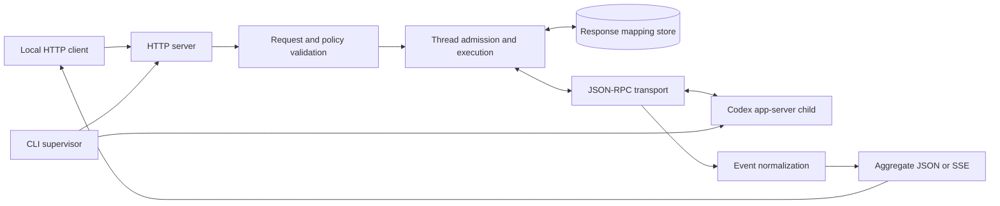

# Proxy architecture

This page is for contributors changing the proxy's runtime behavior. The [README](../README.md) defines the public Chat Completions contract; [continuation](continuation.md) explains response IDs, tool results, and thread reuse in detail.

## Request and process flow

| Boundary                 | Owner               | Responsibility                                                                                                                                        |
| ------------------------ | ------------------- | ----------------------------------------------------------------------------------------------------------------------------------------------------- |
| Process lifecycle        | `src/cli/`          | Start the loopback listener, authenticate and supervise one private app-server transport, gate readiness, and clean up on shutdown.                   |
| Configuration and policy | `src/core/`         | Parse CLI settings, validate the loopback address and canonical root, resolve effective request policy, and write structured logs.                    |
| App-server integration   | `src/app-server/`   | Spawn the pinned Codex executable without a shell, correlate JSON-RPC messages, manage authentication and the model catalog, and read the model list. |
| HTTP contract            | `src/http/`         | Route requests, validate Chat Completions input, execute turns, normalize app-server events, and serialize JSON, SSE, and errors.                     |
| Continuation state       | `src/continuation/` | Persist response-to-thread mappings, pending client tool calls, usage boundaries, and thread leases.                                                  |

The HTTP listener opens before app-server authentication completes. `/health` reports that the proxy process is listening; `/ready` and model or chat requests require an authenticated, initialized app-server transport. If the child exits, the supervisor withdraws readiness and makes bounded restart attempts. It installs a replacement transport only after startup succeeds.

## Startup ownership

The proxy uses the exact `@openai/codex` package pin by default and rejects an explicit executable override with a different reported version. It runs app-server in a proxy-owned Codex home, separate from the ordinary Codex CLI home. Authentication can synchronize a strictly newer `auth.json` from the ordinary home unless `--sync-auth never` is set; the normal login flow handles an absent or unusable credential. The proxy never stores credentials in its continuation records.

Each new proxy process makes one bounded, catalog-only refresh attempt in a temporary Codex home. A valid refreshed cache replaces the selected home's cache; a failed refresh retains the previous cache. The temporary Responses Lite catalog override is built separately from Codex's refreshable cache and must be loaded by the serving child before readiness. Because catalog selection is a startup setting, installing or rebuilding the override can require a private child restart. App-server recovery within the same proxy process does not repeat the catalog refresh. See [upstream compatibility](codex-app-server.md#pinned-compatibility-note) for the pinned protocol context.

## HTTP translation

The public routes are `/health`, `/ready`, `GET /v1/models`, and `POST /v1/chat/completions`. The model route reads the active app-server catalog without starting a Codex thread or turn. A chat request is validated and assigned an effective policy before any turn starts. Execution chooses a fresh thread or an admitted continuation, then uses the same app-server event stream for aggregate JSON and SSE output. The event normalizer exposes only supported activity; unknown notifications remain diagnostic. Token usage appears only when app-server provides attributable counts.

For streaming, setup and the first event are processed before SSE headers are committed so early failures retain their HTTP error status. After headers are sent, failures are emitted inside the stream. Output writes honor backpressure; request cancellation and deadlines release the active turn and its transport work. [Continuation](continuation.md) describes how client-defined tool batches end a turn and resume through later HTTP requests.

Child-agent lifecycle events are observational `x_codex` tool activity. The pinned app-server may report a start as `subAgentActivity` rather than `spawnAgent`; the normalizer preserves the recognized activity kind and child thread ID in arguments and result content, while omitting agent paths. This preserves correlation without making child activity a client-executable function call.

## Policy boundary

The listener binds only to a validated loopback address and rejects non-loopback `Host` values and requests carrying `Origin`. A request's `x_codex` controls are constrained by the configured canonical root and app-server managed requirements. The proxy rejects a requested policy it cannot apply faithfully; it never relaxes a stricter requirement. The default `disabled` sandbox removes execution environments; built-in filesystem access and hosted web search require explicit allowed selections. Client-defined tools remain available. Child-agent spawning is a separate process-wide `--subagents` opt-in, independent of per-request policy.

On native Windows, the proxy reads effective configuration for the request's canonical working directory before starting or resuming a thread. It supplies `windows.sandbox = "unelevated"` only when neither user/project configuration nor managed requirements select a backend. A failed or malformed `config/read` fails the request before execution; the default is a per-thread override, never a persisted or process-wide rewrite.

The [security model](security.md) covers local access, persisted data, and sensitive plaintext logs. Contributor commands and offline versus live verification are in the [repository guide](development.md).
