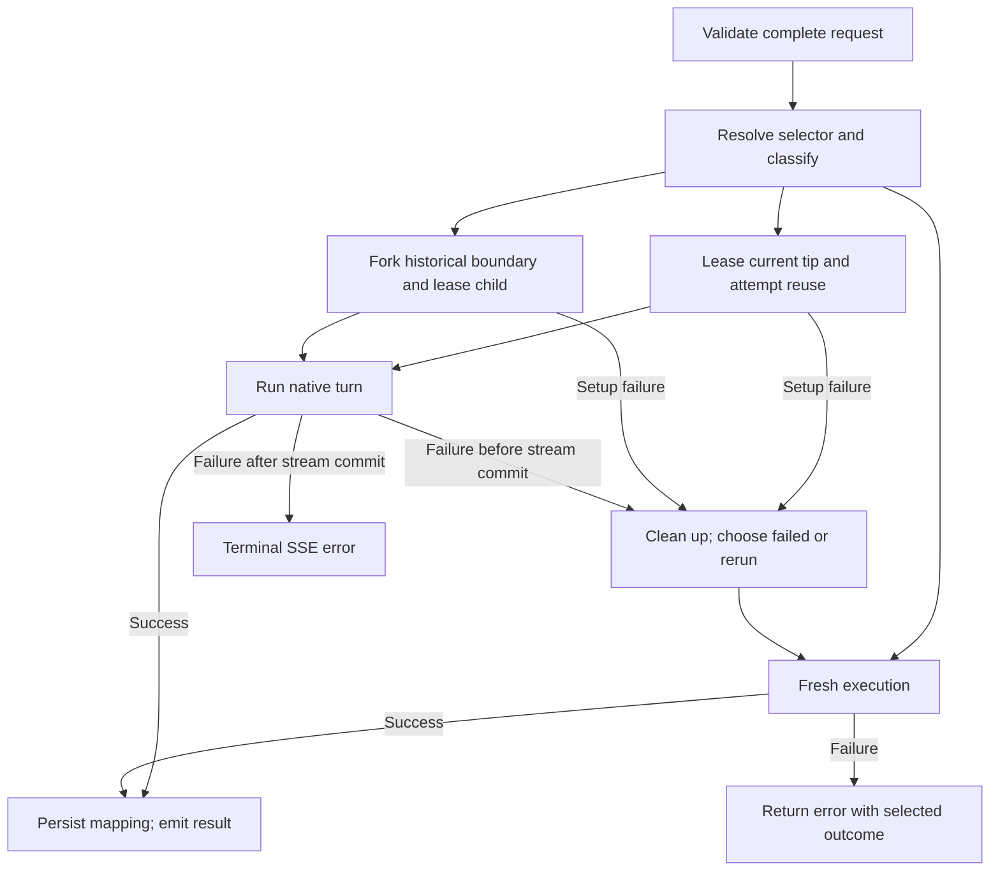

# Stage 09: Thread continuity and safe branching

## Status and goal

Planned and not implemented. This document is the design and acceptance gate; runtime source,
tests, schemas, and published API documentation continue to describe Stage 08 until implementation.

Let clients send their complete intended Chat Completions transcript, reuse an available current
Codex thread, and fork a completed historical boundary. When continuity cannot serve a request,
make at most one fresh attempt. Preserve policy validation and prevent duplicate delivery through
the same response checkpoint.

## Simplifying decisions

1. **Classify once, execute once, fall back once.** Resolve explicit and implicit selectors into
   the same routing decision. A shared wrapper handles native failures and calls the fresh
   executor directly; fallback never re-enters routing.
2. **Forks do not mutate their source.** Remove fork reservations, tail hashes, claim sets, and
   fork cleanup writes. Each fork creates a new child that is unreachable through the proxy until
   its response mapping commits. Retries create another child instead of adopting an uncertain
   child. Duplicate branches fit the accepted at-least-once model.
3. **Unresolved checkpoints are unavailable.** Remove exact-tail comparison and different-tail
   branching through an unresolved direct claim. Every request selecting that checkpoint falls
   back fresh. Only a completed `superseded` checkpoint can fork.
4. **One tool fence is enough.** Replace `tool_injection_claimed` and `tool_consumed` with
   `tool_fenced`, committed before injection. Only the owning request may inject once and,
   after confirmation, start once. No second write is needed between injection and start.
   Restart never reconstructs permission to continue that attempt.
5. **One outcome rule covers every fallback.** Choose `failed` or `rerun` when abandoning
   continuity, then preserve that value through the fresh response or error.

These decisions remove retry deduplication machinery while retaining durable protection for
same-thread delivery. Their compatibility consequences are recorded below.

## Public contract

### Transcript and selector

`previous_response_id` remains a nonstandard proxy request extension. There is no raw thread-ID
selector or force-fork field. Clients always submit their complete intended transcript.

Native continuation consumes only one terminal user message, or a validated contiguous terminal
tool-result block matching the selected pending batch. The selected response ID declares the
boundary immediately before that input. The proxy cannot compare the replayed prefix with native
history: reuse and fork ignore it, while fresh execution consumes the complete transcript.

Validate syntax, effective policy, transcript representability, and dynamic-tool shape before
routing or app-server side effects. Malformed, orphaned, unanswered, or otherwise unrepresentable
tool history remains a typed OpenAI-shaped client error. A complete transcript that does not
match the selected pending batch can fall back fresh; never reinterpret tool output as user text.

Without an explicit selector, a terminal tool block requests implicit continuation when enabled.
Resolve it against pending call IDs. With implicit mode disabled, this shape remains a pre-routing
client error requiring `previous_response_id`. An already validated request assigned to fresh
fallback bypasses implicit lookup and this selector requirement.

### Continuity metadata

Replace `x_codex.threadReused` with the nonstandard response extension
`x_codex.threadContinuity`; there is no boolean alias.

| Value | Meaning |
| --- | --- |
| `none` | No continuity was requested or inferred; the ordinary fresh path ran. |
| `reuse` | The selected current checkpoint resumed its Codex thread and its next turn was accepted. |
| `fork` | The selected historical checkpoint produced a validated child and its next turn was accepted. |
| `failed` | Native continuity was unavailable before this attempt delivered terminal content; a fresh fallback was selected. |
| `rerun` | Native delivery was accepted or ambiguous, or the selected checkpoint was already fenced; a fresh fallback was selected. |

`rerun` is conservative: a fence indicates possible prior activity after the checkpoint, not
proof that this request's exact tail ran. Outcomes describe this routing attempt, not a durable
deduplication history. Concurrent or later historical forks may each return `fork`.

Success has HTTP 200 and a standard response `id`, including when final mapping persistence fails.
Every fallback retains its chosen `failed` or `rerun` on both success and error. An ordinary fresh
failure has `none`. Pre-routing client errors omit continuity metadata. Preserve existing nested
error metadata such as `error.x_codex.reset_at`.

Aggregate responses and pre-header JSON errors place continuity at top-level `x_codex`. SSE places
it only on the first chunk; later chunks and terminal error events never repeat it. The stream
commit rule below ensures this value cannot become stale after fallback.

## Routing

Resolve a candidate and reserve any current-tip lease synchronously, without an intervening
`await`. Classify from the current durable in-memory snapshot using this ordered table:

| Condition | Decision |
| --- | --- |
| No selector and no terminal tool block | Fresh with `none`. |
| No explicit selector; any requested call ID overlaps an unexpired `tool_fenced` record | Fresh fallback with `rerun`; takes precedence over pending-match ambiguity. |
| No explicit selector; no unique complete unexpired pending match | Fresh fallback with `failed`. |
| Explicit selector is unknown, evicted, or expired | Fresh fallback with `failed`. |
| Selected unexpired record is `turn_start_claimed` or `tool_fenced` | Fresh fallback with `rerun`, before binding or native-tail checks. |
| Binding or native-tail compatibility differs | Fresh fallback with `failed`. |
| Selected record is `ready` or `pending_tool`; source lease is busy | Fresh fallback with `failed`; do not queue or fork it. |
| Selected record is `ready` or `pending_tool`; source lease acquired | Attempt reuse. |
| Selected record is `superseded`, has nonempty `turnId`, and no active client dynamic tools | Attempt fork with a terminal user message. |
| Any other valid request | Fresh fallback with `failed`. |

Implicit correlation requires the complete pending batch and exactly one mapping. Any partial
overlap with an unexpired tool fence blocks native correlation. Expired records never authorize
native execution. Claim retention is defined in the persistence section.

Classification and current-tip lease acquisition form one synchronous operation. With one store
writer and no intervening `await`, there is no routing retry loop. After setup awaits, the fence
write must still compare the expected source state, expiry, and lease ownership; if that check
fails, clean up and fall back instead of reclassifying. Only a record already classified as
`superseded` may take the fork path.

Contention is explicit: before request A commits its fence, B sees a busy ready/pending tip and
falls back with `failed`; after the fence, B falls back with `rerun`. Neither case forks the
active checkpoint, even with a different tail. An already superseded R1 may fork while a later
R2 on the source thread is active.

The fresh executor cannot call the router or native executor. This structural boundary replaces
recursive redirect logic and makes the one-fallback limit explicit.

## Native execution

### Reuse

Hold the source lease through setup, execution, terminal resolution, and cleanup. Validate
`thread/read` and `thread/resume` responses, including expected thread identity, resumable
status, instruction-source shape, and effective binding/policy. Malformed or inconsistent server
responses are native setup failures, not malformed client input.

For `ready`, durably change the checkpoint to `turn_start_claimed` before sending exactly one
`turn/start` with only the terminal user message. For `pending_tool`, durably change it to
`tool_fenced`, inject the matching complete call/output pairs once, and send exactly one
empty-input `turn/start` only after injection is confirmed.

A fence write authorizes only this in-memory attempt under this lease. A loaded fence never
authorizes resume, injection, or start. If its write fails, send no dependent native call.
Timeout, malformed acknowledgement, transport loss, or process exit after dispatch is ambiguous
unless the transport proves non-acceptance. Only definitive rejection of the dependent operation
permits restoration; a generic exception is insufficient.

Client-defined dynamic tools retain the Stage 05 batch boundary contract. A pinned or resumed
tool-bearing thread must prove raw-response boundary capability on the current transport before
injection or start; otherwise fall back with `failed`. Built-in Codex tools remain observational
and do not trigger this restriction. `tool_choice: "none"` has no active dynamic tools.

### Fork

Fork only a compatible `superseded` record with nonempty stored `turnId` and no active client
dynamic tools. Requests with active dynamic tools fall back with `failed` because native fork
cannot enable a reliable raw-response boundary.

Use `thread/fork` with `threadId`, inclusive `lastTurnId`, `excludeTurns: true`,
`deferGoalContinuation: true`, `ephemeral: false`, `model`, and validated supported thread-policy
fields. Omit `path`, `beforeTurnId`, `baseInstructions`, `developerInstructions`, and unsupported
reasoning-effort overrides. No pre-fork `thread/read` is needed.

Validate the response before leasing or starting the child:

- Nonempty child ID different from the source, `forkedFromId` equal to the source, non-ephemeral
  identity, idle status, `canAcceptDirectInput: true`, and empty returned turns.
- Top-level model, cwd, normalized reasoning effort, approval policy, approvals reviewer, and
  sandbox policy against the request and stored binding.
- Instruction sources as a valid string array to report with this attempt's response. No expected
  source list is stored, so do not add an equality comparison.
- Child cwd equal to response cwd, and child model provider equal to response model provider.

Fork inheritance plus the validated source relationship supplies provider continuity; no provider
field is added to the stored binding. Informational fields without a selector or stored comparator,
including runtime workspace roots, active permission profile, service tier, and history mode,
are not equality-gated. Reapply effective cwd, sandbox, approval, and environment policy at
`turn/start`; never weaken managed constraints.

Lease the child, send one terminal user turn, and publish its mapping only after a reusable
response completes. Source records and retention deadlines remain unchanged. Concurrent forks,
including identical tails, independently own their children. Forking R1 after R2 must include
R1 and exclude R2 and all later source turns.

A rejected, malformed, or lost fork acknowledgement before child start permits fallback with
`failed`: deferred goal continuation prevents automatic execution. Child lease failure does
the same. Ambiguous child start permits fallback with `rerun`. Never retry start on that child
or adopt it after restart. An unexposed child may remain an orphan; no deletion is required.

## Fallback and output lifecycle

One shared wrapper handles native failure before downstream commitment. Select `rerun` if
injection/start was accepted or may have been accepted, otherwise `failed`. A pre-existing fence
already selects `rerun`. Preserve this outcome through every fresh response or error. The ordinary
fresh executor has no fallback of its own.

Before fallback, stop consuming the abandoned attempt, remove its request-scoped listeners, and
perform bounded best-effort interruption of any known active turn. Resolve its durable state using
the transition table, then release its source or child lease. Uncertain effects keep their fence;
never wait indefinitely for an orphan. Do not start fallback after client disconnect, cancellation,
or expiry of the request deadline. Fallback uses the remaining deadline.

Fresh execution always creates a new thread under validated request policy. Inject complete
history and start with the terminal user message. For a tool-ending transcript, inject all complete
call/output pairs including the terminal block and start with empty input. Explicit and implicit
selectors are execution-inert here. Allocate a response ID without overwriting the source mapping.

For aggregate requests, discard the abandoned attempt's buffered output, usage, instruction
sources, and identifiers. Return only the winning attempt's output and metadata.

For SSE, delay headers and the initial role/metadata chunk until the attempt has its first
publishable delta or a successful terminal result. Setup/history notifications and internal events
do not commit a stream. Commit the role chunk and first output as one logical boundary: after
any chunk is written, no fallback is allowed, including during backpressure. A later failure ends
with the terminal SSE error and no `[DONE]`; downstream can retry the whole request. A failure
before commitment can fall back and select new metadata. Reasoning and tool-call deltas count
as output; also support an empty successful response.

Filter events against the accepted thread and turn IDs. Buffer notifications arriving before
the start acknowledgement until correlated. Never replay retained native history, including old
reasoning, command output, or internal tool events, into the new HTTP response. Preserve the
existing documented observational output and `x_codex` extensions for the current accepted turn;
their publishable deltas also count toward SSE commitment.

Persist a mapping only after its response is reusable. If final persistence fails, still emit
the completed aggregate response or finish SSE with its standard `id`. That ID cannot resolve
later. Direct reuse retains its predecessor fence; a fresh or forked thread has no exposed
mapping. Historical forks cut at the stored boundary and exclude later unmapped turns.
Downstream treats an ID as completed only after terminal success.

Reuse starts from the selected record's exact `usageTotal`; fork also uses that baseline and
omits usage when exact subtraction is unavailable or counters reset. Fresh `none`, `failed`, and
`rerun` execution uses zero baseline. Report only available exact counts for the winning attempt,
including cached-token counts; never estimate usage or promise cache reuse.

## Persistence

### Records and transitions

Keep one authoritative `continuations.json` under `--state-dir`, one record per response ID, and
the existing binding fields. Add only `turnId?: string | null`. New mappings require nonempty turn
IDs; mutations preserve absent/null legacy boundaries. Legacy current tips may reuse; historical
records without boundaries fall back. Retain the single-writer store and process-local lease model.

| State | Meaning and allowed route | `pendingCalls` |
| --- | --- | --- |
| `ready` | Current checkpoint; user-tail reuse eligible. | Forbidden |
| `pending_tool` | Current checkpoint; matching tool-tail reuse eligible. | Required, nonempty |
| `superseded` | Completed historical boundary; user-tail fork eligible. | Forbidden |
| `turn_start_claimed` | Direct-start fence; all selecting requests fall back with `rerun`. | Forbidden |
| `tool_fenced` | Tool-delivery fence, whether injection is unresolved or consumed; all selecting requests fall back with `rerun`. | Required, nonempty |

At most one `ready` or `pending_tool` record exists per thread. Tool fences stay non-branchable
until retention removes them. A fence protects its checkpoint: a successful owning attempt may
create a new selectable tip on that thread. An old tool fence does not ban continuation from
that new tip.

| Event | Atomic durable transition |
| --- | --- |
| Direct start about to dispatch | `ready` → `turn_start_claimed`; extend retention. |
| Tool injection about to dispatch | `pending_tool` → `tool_fenced`; extend retention. |
| Fence write fails | Preserve prior snapshot; do not dispatch; fallback with `failed`. |
| Direct start definitively rejected without acceptance | Restore `ready`; fallback with `failed`. |
| Tool injection definitively rejected without acceptance | Restore `pending_tool`; fallback with `failed`. |
| Restoration write fails | Retain fence; current request still falls back with `failed` because rejection is known. |
| Injection confirmed | No write; owner may start once; `tool_fenced` remains. |
| Start rejected after confirmed injection | Keep `tool_fenced`; fallback with `rerun`. |
| Injection/start ambiguous, or owner crashes/disconnects | Keep fence; no later request resumes this checkpoint. If still connected and within deadline, fallback with `rerun`. |
| Direct reuse completes with reusable response | Atomically change predecessor to `superseded` and add new `ready`/`pending_tool` tip. |
| Tool continuation completes with reusable response | Keep `tool_fenced`; atomically add new tip. |
| Known terminal model failure on direct reuse | Change predecessor to `superseded`; no new tip. Fallback with `rerun` if output lifecycle permits. |
| Known terminal model failure on tool continuation | Keep `tool_fenced`; no new tip. Fallback with `rerun` if permitted. |
| Fresh/fork execution completes with reusable response | Add new tip; no source mutation. |
| Fresh/fork execution fails | No mapping to add or source claim to clean up. |
| Terminal state or final mapping write fails | Retain last committed snapshot and fence; completed output is still emitted. |

All mutations build a candidate snapshot, atomically persist it, then publish in memory.
Serialize commits or compare-and-swap against the latest snapshot so independent completions
cannot lose each other's mappings. Reads never expose uncommitted ready states. Keep existing
state-file path hardening and coordinator lease ownership checks.

Expiry is derived from `expiresAt`; `expired` is not a v2 state. Taking a fence sets its deadline
to at least `now + retentionMs`, monotonically. Restoration or terminal resolution never shortens
it. Expiry makes a checkpoint ineligible for every native route even before pruning. Forks do
not refresh their sources.

### Migration and validation

Bump the unreleased schema from 0 to 2 in place; version 1 remains the abandoned, untrusted shape.
There is no second state file, import marker, or quarantine file.

| v0 record | v2 record |
| --- | --- |
| `ready` | `ready` |
| `pending_tool` with pending calls | `pending_tool` |
| `superseded` without pending calls | `superseded` |
| Persisted `expired` tool replay tombstone | `tool_fenced`; preserve pending calls. |
| `superseded` with pending calls | `tool_fenced`; preserve pending calls. |

Preserve absent/null legacy `turnId`. Commit migration before the HTTP listener starts;
migration-write failure fails startup. Corrupt JSON or foreign/abandoned shapes are an empty
untrusted store, untouched until a later write. Future versions fail startup without overwrite.
Recognized v2 snapshots with any invalid record fail startup unchanged; never selectively discard
a fence. Version 2 has not shipped, so earlier drafts need no v2 migration.

Validate state/pending-call combinations, unique response IDs, unique call IDs within each batch,
the one-current-tip invariant, and existing binding/timestamp/usage types. A present turn ID must
be nonempty or null; the insertion API separately requires a nonempty value for new mappings.
Tail hashes and fork-claim fields do not exist.

## Implementation sequence

Current entry points are `handleChatCompletion` in `src/http/chat.ts:18`, `execute` in
`src/http/chat-execute.ts:272`, `resumeContinuation` in that file at line 831, and `ResponseStore`
in `src/continuation/state.ts:63`. The executor already has history injection, leases, and cleanup;
the store needs commit-then-publish instead of mutation before save. Generated
`protocol/generated/typescript/v2/ThreadForkParams.ts` supplies inclusive and deferred-goal fields.

1. **Store and schema:** implement v2 migration, strict validation, conditional fence/restoration
   writes, atomic final mappings, and retention in `src/continuation/state.ts` and
   `protocol/schemas/response-mapping.schema.json`. Add offline persistence coverage.
2. **Routing:** put explicit/implicit resolution and the ordered decision table in a narrow
   continuation module. Keep syntax/representability in `src/http/chat-validate.ts`; move implicit
   lookup out of the HTTP envelope handler. Return a fresh decision with outcome, or a native
   decision with its selected checkpoint and any acquired lease.
3. **Execution:** extract fresh, reuse, and fork setup behind the common session in
   `src/http/chat-execute.ts`. Add fork validation and the one-fallback wrapper. Keep attempt-local
   output, metadata, cancellation, event correlation, and usage isolated.
4. **HTTP output:** update `src/http/chat.ts`, `src/http/chat-sse.ts`, error envelopes, and
   `protocol/schemas/x-codex.schema.json` for the enum and stream commit rule. Preserve nested
   errors and completed output when final persistence fails.
5. **Verification and docs:** implement the acceptance matrix with generated typed synthetic
   fixtures, then align README, API contract, Stage 05, changelog, and quality/live-test docs.

## Acceptance matrix

Each row requires deterministic offline coverage using the fake app-server and generated typed
fixtures. Exercise relevant success/failure variants. Persistence tests inspect both disk and
memory after injected failures.

| Area | Required coverage |
| --- | --- |
| Validation | Invalid syntax/policy; orphaned/unanswered tool history; valid transcript with incompatible selected tail; implicit-disabled rejection; pre-routing errors omit continuity. |
| Routing | No selector; current/historical cursor; branch of branch; unknown/expired/evicted cursor; binding mismatch; missing legacy boundary; all table precedence cases. |
| Implicit tools | Unique complete batch; unknown/expired/ambiguous IDs; partial overlap with tool fence; pending mismatch; native success and full-history fallback. |
| Contention | Second request before/after fence commit; different tail cannot fork a claimed source; synchronous classification/lease; state/expiry/ownership check after setup awaits; historical fork while later source turn runs. |
| Reuse setup | Missing/non-resumable thread; malformed/mismatched read/resume; effective policy mismatch; missing boundary capability after restart; no dependent call after failed fence write. |
| Direct fence | Rejection/restoration; failed restoration; lost/malformed start ACK; process exit; known terminal failure; successful atomic successor; failed final commit; restart at fence. |
| Tool fence | Pre-injection write failure; definitive injection rejection/restoration; ambiguous injection; confirmed injection then rejected/ambiguous/accepted start; no second write between injection and start; restart cannot continue owner attempt. |
| Tool successor | Old fence remains; new tip is selectable; old explicit/implicit selectors fall back; final write failure emits output without publishing tip. |
| Fork setup | Exact arguments; no pre-fork read; inclusive boundary excludes later turns; every child validation field; dynamic-tool restriction; rejected/malformed/lost fork ACK; child lease failure. |
| Fork isolation | Concurrent same/different tails get distinct children; source and retention unchanged; lost child-start ACK never leads to child adoption; unmapped child unreachable. |
| Fallback | Every native failure category makes at most one fresh attempt; complete history received; terminal tools inject once then empty-input start; outcome unchanged on fresh success/error; no recursion. |
| Output | Aggregate discards abandoned output; first-chunk-only SSE metadata; failure before commitment may fall back; failure after any chunk cannot; reasoning/tool deltas; empty success; backpressure/disconnect during commit; preserved reset metadata. |
| Lifecycle and transport | Cancellation/deadline suppress fallback; listeners/leases cleaned up; bounded interruption; partial frames; interleaved/historical events; duplicate tool results; process failure and lost ACKs. |
| Mapping and usage | Unique IDs; failed mapping preserves output and prior snapshot; independent commits preserve each other; exact reuse/fork subtraction; reset/unknown baselines; fresh zero baseline; no abandoned usage or inferred cache. |
| Migration | All v0 mappings; absent/null boundary preservation; new IDs required; v1/corrupt/foreign handling; future/invalid-v2 startup failure; migration write failure; state invariants; fence retention and expiry. |

The fake server must prove native execution receives only terminal input, fallback receives
complete history, no checkpoint permits a second delivery after an ambiguous operation, and
retries never resume unpublished children. Existing default tests stay offline.

### Opt-in live gate

Use one serial scenario with only `gpt-5.6-luna`, a loopback proxy, and a temporary
`workspace-write` root. Expected maximum: exactly three model calls within the suite-wide ceiling
of 32, counted through deduplicated `rawResponse/completed` events:

1. Fresh R1.
2. Current-tip R2 reuse.
3. Fork R1 after trimming R2; inspect source/child IDs and verify R1 is included and R2 excluded.

Assert `none`, `reuse`, and `fork`. Any fallback fails the live assertion rather than adding a
retry. Enforce the three-call cap across all attempts, including fallback calls. Observe cache
metadata without requiring positive cached tokens. Keep captures transient; only synthetic
placeholders enter repository artifacts. Never run this scenario in default tests or pull-request
CI. It is not run during this documentation revision.

Stage 09 completes only after this matrix, runtime/schema/documentation alignment, and the bounded
live gate pass. Provider limitations leave it incomplete until the plan is reviewed and revised.

## Compatibility and scope

Implementation removes the prerelease boolean, permits native historical branches, and changes
valid continuity failures from typed errors to a fresh result when possible. Ambiguous or accepted
native effects may execute again in a new thread. Completed output survives final mapping failure,
but its unmapped ID cannot continue natively. Malformed input remains a typed error. No standard
Chat Completions field is redefined.

Relative to the earlier Stage 09 draft, concurrent identical historical forks may both return
`fork`; there is no same-tail loser or fork claim after a crash. Every request selecting an
unresolved direct checkpoint falls back with conservative `rerun`, including a different tail,
instead of branching through it. Tool injection no longer depends on a second consumed-state
write. SSE fallback ends at the first chunk, including metadata. Expired fences are ordinary
expired cursors and cannot authorize native execution.

When implementing, update `plans/05-tools-and-threads.md` to remove its boolean, newest-only
restriction, and never-`thread/start` continuation rule. Preserve its implicit-disabled client
rejection while documenting that internal fresh fallback bypasses selector lookup. Update the
root README, `protocol/CONTRACT.md`, both maintained response schemas and fixtures, changelog,
and quality/CI docs. The plan index continues to label Stage 09 as unimplemented.

No exactly-once execution, tail deduplication, raw thread-ID exposure, force-fork request field,
orphan deletion, second state file, policy relaxation, or token estimation is introduced.
