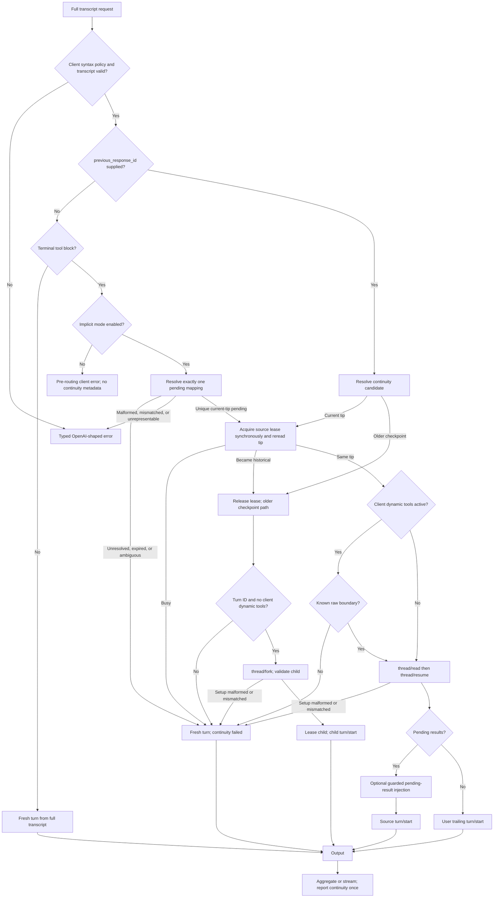
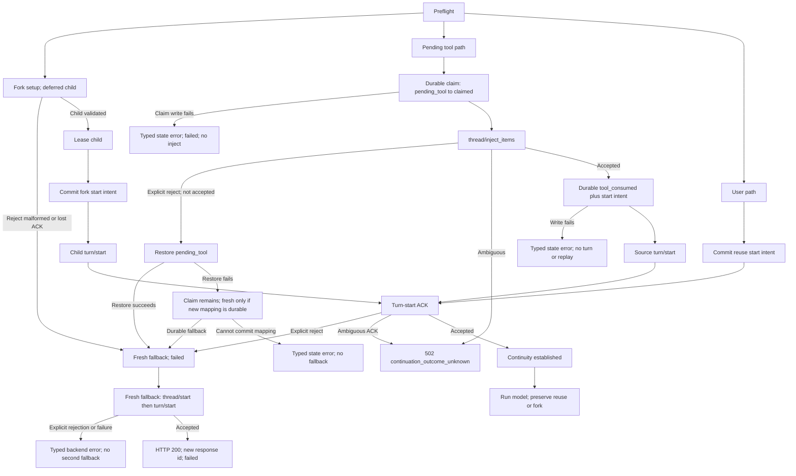
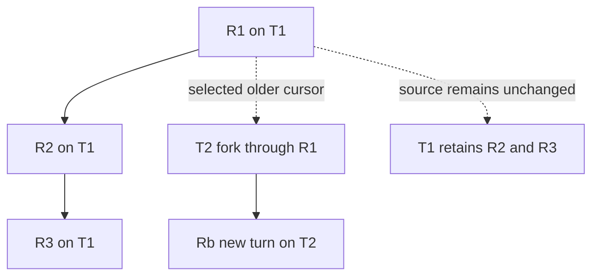

# Stage 09: Thread continuity and safe branching

## Status

Planned and not implemented. This stage supersedes the current `x_codex.threadReused` and
"newest response only" decisions when implementation begins. It is a design and acceptance
gate; it does not change runtime source, tests, schemas, or user-facing documentation yet.

## Summary

Thread continuity lets a client submit its complete intended Chat Completions transcript while
the proxy uses retained Codex history when it can do so safely. An explicit continuation selector
is either absent, points at the current response tip, or points at a retained older response. A
request without `previous_response_id` and without a terminal tool block is fresh; an implicit
terminal tool continuation may instead resolve one current-tip pending mapping. The proxy reports
the outcome through the additive response-level `x_codex.threadContinuity` enum:

| Value | Meaning |
| --- | --- |
| `none` | A fresh thread was selected without a continuity selector. |
| `reuse` | The selected current tip continued the same Codex thread. |
| `fork` | The selected retained older response created a native Codex child thread. |
| `failed` | A valid continuity attempt safely fell back to a fresh thread, or continuity setup failed after a safe result could no longer be asserted. |

`x_codex.threadReused` is removed; there is no alias. The extension is nonstandard and appears
once on an aggregate response, or only on the first SSE chunk. Every successful response has an
`id`, including a fresh fallback response.

Once routing is classified, every pre-header JSON error carries the actual top-level
`x_codex.threadContinuity` outcome: `none`, `reuse`, `fork`, or `failed`. `reuse` and `fork` are
reported only after their turn start is accepted; an uncertain setup outcome is `failed`. Thus a
post-setup model error reports `reuse` or `fork`, a fallback or uncertain-outcome error reports
`failed`, and a fresh no-selector error reports `none`. Client-validation errors raised before
routing omit the field. Preserve nested `error.x_codex.reset_at` metadata. SSE emits continuity
only on its first chunk; a later error event never repeats it. A setup failure before the first
chunk follows the JSON rule.

## Public contract

### Routing rules

1. The selector is the existing additive `previous_response_id` field. Without it and without a
   terminal tool block, start a fresh thread and report `x_codex.threadContinuity: "none"`.
2. Without `previous_response_id`, a terminal tool block uses implicit continuation only when that
   mode is enabled. Resolve exactly one unexpired pending mapping; a unique current-tip mapping
   follows same-thread reuse. An unresolved, expired, or ambiguous but fully representable
   transcript fresh-falls back with `failed`; malformed, mismatched, or unrepresentable tool
   input is a typed client error.
3. With implicit mode disabled, that terminal-tool shape is the existing pre-routing client error
   requiring `previous_response_id`; it carries no continuity metadata.
4. A selector for the selected thread's current response tip uses native same-thread resume and
   reports `"reuse"` only after resume and the next turn start both succeed.
5. A valid retained older response uses native `thread/fork` at its stored turn boundary and
   reports `"fork"` only after the child is validated, leased, and its turn starts.
6. There is no force-fork request field. A client chooses a cursor with the agreed continuation
   selector; the proxy decides whether that cursor is a tip or branch point.
7. The downstream client always sends its full intended transcript. Successful reuse and fork
   ignore the replayed prefix and consume only trailing new input or the pending tool results.
   Native history is internal: old reasoning, command deltas, and internal tool events are never
   replayed downstream.
8. Built-in Codex tools remain observational. Client-defined dynamic tools retain the Stage 05
   tool-call/result contract and are subject to the boundary capability rule below.

### Safe fallback and errors

If a valid, representable request cannot safely establish continuity before model execution,
start a fresh thread from the submitted full transcript, return HTTP 200, allocate a new
reusable response ID, and report `x_codex.threadContinuity: "failed"`. This includes a binding
mismatch, unknown/evicted or non-resumable cursor, malformed or mismatched `thread/read` or
`thread/resume` response, missing historical `turnId`, malformed or mismatched `thread/fork`
response, bad child relationship, and an explicit fork rejection. A fork is pre-execution
because `deferGoalContinuation: true` prevents it from automatically running a child turn; an
abandoned child may remain as a logged orphan. This is the normal availability rule: lookup or
safe setup failure alone must not reject a valid request whose full transcript can be represented.
It does not weaken input/policy validation or promise service when the app-server or model is
unavailable.

Typed rejection is reserved for malformed, unsafe, ambiguous, or unrepresentable client input,
fallback backend failure, and uncertainty after an executable side effect. A malformed or
mismatched app-server setup response before a child turn is instead a safe fresh fallback.

An explicit native `turn/start` rejection known not to have been accepted is safe: for direct
reuse, atomically restore `ready` and resolve its start intent; for a fork, remove the child
start intent; then permit one fresh fallback with `failed`. After confirmed pending-tool
injection, the checkpoint remains `tool_consumed` even when its subsequent native turn start is
explicitly rejected; it is never restored to direct-reusable state. An explicit injection
rejection is handled separately by restoring `pending_tool` when that restoration is durable. If
a start or injection may have been accepted but its acknowledgement was lost, do not retry and
risk duplicate commands. Return HTTP 502 with code `continuation_outcome_unknown` and top-level
`x_codex.threadContinuity: "failed"`. The same rule applies after pending-tool injection becomes
uncertain; do not fresh-replay that transcript.

A later model failure after reuse or fork has already succeeded does not rewrite `reuse` or
`fork` to `failed`; the continuity result describes thread setup, not model completion.
Existing nested error metadata, such as `reset_at`, remains unchanged. Errors representing failed
continuity setup put `x_codex.threadContinuity: "failed"` at the envelope top level.

Current-tip busy is immediately fresh/failed. The proxy does not attempt a rescue fork for this
case. A source thread remains unchanged after a fork, and its retention timestamp is not
refreshed by creating a child.

### Dynamic-tool boundary

Native fork cannot enable a reliable raw-response boundary, so it is allowed only when the
request has no client-defined dynamic tools. A tool-bearing thread resumed after restart is
allowed only when the current transport proves the boundary capability; a pinned or resumed
thread without that capability also fresh-falls back before turn start or injection with
`failed`. Built-in Codex tools do not trigger this restriction. `tool_choice: "none"` is safe when
no active dynamic tools exist.

Implicit tool IDs must be known, unexpired, and unambiguous. A complete transcript with unknown,
expired, or ambiguous implicit IDs can still use fresh fallback when it is representable; it is
not rejected solely because continuity correlation failed. A pending result that mismatches the
stored batch remains a typed client validation error. An unrepresentable terminal tool block
remains a typed client error.

### Native trailing input

For native reuse or fork, the selected response ID must immediately precede exactly one of these
tails in the client's intended transcript:

- one terminal `user` message; or
- one validated contiguous terminal block of `role: "tool"` results matching the selected pending
  batch.

The `ready` checkpoint uses the user tail; a `pending_tool` checkpoint uses only its matching
terminal tool-result block. Any other pairing is malformed or unrepresentable. All earlier
messages are the ignored replay prefix. The client declares the selected ID as the boundary; the
proxy cannot compare the submitted prefix with native history. Any other native continuation tail
is a typed client error. Fresh fallback still receives the full transcript subject to ordinary
representability rules.

## Routing flow

## Side-effect boundary

Fork is not the unsafe side-effect boundary: `deferGoalContinuation: true` prevents automatic
execution, so an explicit fork rejection, malformed fork response, or lost fork acknowledgement
before child turn start can fresh-fallback with `failed` (leaving a possible orphan). The unsafe
boundary is the first point at which app-server may have accepted `turn/start` or
`thread/inject_items`. Before that boundary, setup may safely fall back. At or after it, an
ambiguous outcome is an error and must not execute the same side effect again. This includes a
child `turn/start` acknowledgement lost after a valid fork.

The pending path has an additional durable guard. Never call `thread/inject_items` unless the
`pending_tool` to `tool_injection_claimed` write committed. A claim-write failure is a typed
backend/state error with top-level continuity `failed`; it must not inject or fresh-fallback. If
injection is explicitly rejected as not accepted, attempt to restore `pending_tool`: a successful
restore permits fresh/failed, while a failed restore keeps disk and memory conservatively claimed
and non-replayable. Fresh fallback after failed restoration is allowed only when its eventual new
response mapping can be durably committed; otherwise return the typed backend/state error and do
not expose pending state from memory. After confirmed injection, `tool_consumed` must commit
before `turn/start`; a write failure keeps the claim, prevents start and replay, and returns the
typed backend/state error. A successful response is not terminally emitted until its response
mapping is durable. If final mapping fails, an aggregate returns a typed error; an SSE response
ends with a terminal error and its response ID is explicitly non-reusable. Downstream commits IDs
only after terminal success.

## Branch topology

In the branch example, the client trims R2, submits its edited continuation while selecting R1,
and receives a new response on T2. R2 and R3 remain on T1 and are not replayed or mutated.

Two concrete races are normative:

- Two requests concurrently select current R1. Request A acquires T1; request B observes the
  current-tip lease as busy and immediately starts a fresh thread, reporting `failed`. B does
  not rescue-fork R1.
- A client has R1 → R2, trims R2 from its local transcript, and submits an edited continuation
  selecting R1. The proxy forks through R1, sends only the new turn to the child, and returns
  `fork`; R2 is not present in the branch.

## Architecture and data flow

### Request phases

1. Parse the standard Chat Completions request and the agreed continuation selector. Validate
   client syntax, policy, transcript representability, and dynamic-tool shape before any
   app-server side effect.
2. Load the opaque response mapping from the authoritative v2 store. A selector maps to a
   response, thread, source turn, and continuity binding; raw Codex identifiers never appear in
   the public API.
3. Classify the request as `none`, current-tip `reuse`, older-response `fork`, or safe fresh
   fallback `failed`. Setup responses that are malformed or inconsistent are also safe fallback
   inputs before model execution.
4. For a current-tip candidate, acquire the source lease synchronously from the JavaScript
   request scheduler's perspective, immediately reread the mapping before any `await`, and verify
   that the same ready/pending tip still owns the lease. If unavailable, fresh-fallback immediately
   with `failed`; never rescue-fork. If the reread now says historical, release the lease and route
   through the ordinary older-checkpoint fork path. This prevents appending R1 after it advanced to
   R2.
5. For a native fork, first verify a stored `turnId` and no client-defined dynamic tools. Call
   `thread/fork` with `threadId`, `lastTurnId` set to the selected response's stored `turnId`
   (inclusive), `excludeTurns: true`, `deferGoalContinuation: true`, `ephemeral: false`, `model`,
   and only validated supported thread-policy fields. Deliberately omit `path`, `beforeTurnId`,
   `baseInstructions`, `developerInstructions`, and unsupported reasoning-effort overrides.
   Validate against the effective request: top-level model, cwd, normalized `reasoningEffort`,
   `approvalPolicy`, `approvalsReviewer`, and sandbox policy. Validate a nonempty child ID
   different from the source, `forkedFromId` equal to the source, `ephemeral: false`, idle status,
   `canAcceptDirectInput: true`, empty turns because `excludeTurns` was requested, valid
   `instructionSources`, child `cwd` equal to the response cwd, and child `modelProvider` equal
   to both the fork response's top-level provider and the source provider returned by the
   pre-fork `thread/read`. Also validate every returned effective model, cwd, reasoning, approval,
   and sandbox field the protocol exposes. Sent/per-turn policy overrides cover fields the
   response does not echo. Any mismatch before child turn start is safe fresh-fallback; no
   provider field must be added to the durable checkpoint binding.
6. Start the selected turn with exactly the native trailing input described above. Do not send the
   replayed transcript prefix to a reused or forked native thread. For pending results, atomically
   transition `pending_tool` to `tool_injection_claimed` before `thread/inject_items`, inject each
   complete call/output pair once, and transition to `tool_consumed` before `turn/start`. An
   uncertain injection crosses the side-effect boundary and cannot fall back to a fresh replay. A
   fresh fallback sends the full transcript, including representable paired historical tool rounds.
7. Aggregate or stream standard output. Suppress native history and internal tool events from
   downstream output. Persist a new response mapping only after the response is reusable.
8. Add `x_codex.threadContinuity` at the response envelope boundary. For SSE, emit it only in
   the first chunk; subsequent chunks do not repeat it.

### Fork lifecycle

The source mapping stores the turn boundary needed for a fork. The child must be checked before
lease acquisition and turn start. Since the fork defers goal continuation, explicit rejection,
malformed response, mismatched child relation, or a lost fork acknowledgement before child turn
start can all fresh-fallback with `failed`; an abandoned pre-turn child can remain as a logged
orphan. Do not attempt deletion merely to tidy state. A lost or ambiguous child `turn/start`
acknowledgement is different: it is after the executable side-effect boundary and returns HTTP 502
`continuation_outcome_unknown` without retry.

`runtimeWorkspaceRoots`, `activePermissionProfile`, `serviceTier`, `historyMode`, and other
informational metadata are not equality-gated: there is no public selector or stored comparator
for them. Security comes from the exact source binding plus explicit fork parameters and
reapplication of cwd, sandbox, approval, and environment policy at `turn/start`.

### Persistence schema

The authoritative durable state file is the separate `continuations.v2.json` file under
`--state-dir`, with schema version 2. The existing `continuations.json` is the legacy v0 import
source. The v2 snapshot is a tagged union of checkpoint records and start-intent records.
Checkpoint records use these lifecycle states:

- `ready` and `pending_tool` are the only states eligible to be the one current tip per thread;
  at most one of either exists for a thread.
- `superseded` retains an older forkable checkpoint, except that consumed-tool tombstones are
  never converted into branchable history.
- `tool_injection_claimed` and `tool_consumed` are non-replayable tombstones. A claim is made
  before injection and is never erased merely because a process crashed or disconnected.
- `turn_start_claimed` marks a current ready source whose direct reuse start is guarded by an
  intent; it is non-replayable until terminal resolution.
- Natural TTL expiry is derived from `expiresAt`; `expired` is not a persisted state.
- `failed` is a response outcome, never a persisted state.

Each start-intent record is keyed by its preallocated `responseId` and contains `route` (`reuse`
or `fork`), `sourceResponseId`, `targetThreadId`, a SHA-256 `attemptKey` over the canonical
source selector, exact native tail, and effective bindings, `state: "start_claimed"`, and
retention timestamps. The intent exists while turn acceptance or execution is unresolved. A
provisional start intent does not have a `turnId`; new checkpoint writes require a nonempty
`turnId`.

| Transition | Durable ordering and result |
| --- | --- |
| Direct reuse | Atomically change `ready` to `turn_start_claimed` and create the `start_claimed` intent before `turn/start`. |
| Known direct-start rejection | Atomically restore `ready` and resolve the intent, then permit one fresh fallback. |
| Known fork-child start rejection | Remove the child start intent, then permit one fresh fallback; source remains historical/selectable. |
| Ambiguous direct start or crash | Keep the claimed checkpoint/intent non-replayable; return non-retryable `continuation_outcome_unknown`. |
| Accepted direct start | Keep the checkpoint claimed until terminal resolution; successful final mapping atomically supersedes it, creates the new tip, and removes the intent. |
| Known terminal model failure | Resolve by route and remove the intent: direct ready reuse supersedes its claimed predecessor; a pending-tool route retains its non-branchable `tool_consumed` tombstone; a fork leaves its source checkpoint unchanged. A later deliberate retry or branch is allowed only through the resulting route rules. |
| Pending tool injection | Claim `pending_tool` before injection; after confirmed injection, set `tool_consumed` and create a start intent before the subsequent `turn/start`. |
| Native fork | After child validation, create the fork start intent before child `turn/start`; source remains historical/selectable. |
| New response on same thread | Add the new `ready`/`pending_tool` tip and supersede an eligible ready predecessor; never erase an uncertain claim or turn-start intent. |

Before executing the same source/tail/binding combination again, an unexpired matching
`start_claimed` intent returns non-retryable HTTP 502 `continuation_outcome_unknown`. A different
tail may fork the same source. This blocks a proxy/client retry through this proxy from silently
duplicating an exact ambiguous fork attempt without blocking independent branches. A resolved
attempt has no remaining start intent and does not block a later deliberate retry.
While its checkpoint is `turn_start_claimed`, a source is eligible only as an older fork boundary,
never for direct resume; if native fork is unavailable, use fresh/failed. Once a native start may
have advanced T1, old R1 is never restored to direct-reusable state.

Pending-tool transitions are durable and ordered: atomically move `pending_tool` to
`tool_injection_claimed` before `thread/inject_items`; on an explicit injection rejection known
not to have been accepted, restore `pending_tool` and safe-fallback; on successful injection,
move to `tool_consumed` and create the subsequent start intent before `turn/start`. An ambiguous
injection or crash while claimed keeps the non-replayable claim and returns a typed
`continuation_outcome_unknown` error. Consumed-tool tombstones never become branchable
`superseded` records: a new response on that thread leaves `tool_injection_claimed` and
`tool_consumed` unchanged and adds the new ready/pending tip.

Valid v0 `ready`, `pending_tool`, and `superseded` records migrate directly. A persisted v0
`expired` value is conservatively mapped to `tool_injection_claimed`, because current v0 uses
that value as a replay tombstone; expiry in v2 is otherwise derived only from `expiresAt`. A v0
`superseded` record with `pendingCalls` conservatively migrates to `tool_consumed`; only v0
`superseded` without `pendingCalls` remains forkable `superseded`. Migration preserves absent or
explicit `null` `turnId`; all new checkpoint writes require a nonempty `turnId`. Thus a v0
current-tip or pending record may reuse when its boundary is otherwise valid, while a retained
historical v0 record without `turnId` safe-falls back fresh because it cannot fork.

If `continuations.v2.json` is absent, import a valid v0 `continuations.json` once and preserve
the legacy file. If the legacy file is corrupt or has a v1/future wrapper, treat it as empty and
untrusted, leave it untouched, emit one structured warning, and atomically write an empty v2
snapshot. That v2 snapshot is the one-time migration marker. The v2 file must be atomically
created before the HTTP listener serves requests, even when migration yields no records; failure
to commit the marker fails startup. Once the v2 file exists, never re-import v0.

A malformed v2 file is atomically moved to a unique quarantine name, then an empty v2 snapshot is
committed before serving; failure to quarantine or commit the replacement fails startup. An
unsupported-version v2 wrapper is left untouched and fails startup to prevent downgrade overwrite
or split brain. Neither file is silently overwritten. Existing retention, binding, pending-call,
and atomic-write guarantees remain in force.

Fork usage starts from the source `usageTotal` baseline. Omit usage if exact subtraction is not
possible. Fresh `none` and `failed` responses use a zero baseline.

Every mutation uses commit-then-publish: build a candidate v2 snapshot, atomically persist it,
then replace the in-memory map. On write failure, retain the last durable in-memory view. This
snapshot is committed before any dependent side effect. A response mapping is the commit point
for reusability: no downstream response ID is committed until terminal success and durable
mapping, and a failed final mapping never exposes a new ready state. The aggregate returns a typed
error or the SSE stream a terminal error with a non-reusable ID.
These mapping/state errors retain the already classified top-level continuity outcome: `failed`
for a fallback path, or `reuse`/`fork` after continuity was established.

Caching is orthogonal to continuity. Report exact cached-token counts when app-server supplies
them; never promise positive cache reuse because a thread was reused or forked.

## Edge-case register

Each row is an implementation and test obligation. "Fresh/failed" means HTTP 200 with a new
reusable response ID when the transcript is representable; "typed error" means no fallback is
permitted by the contract.

| # | Case | Required behavior |
| ---: | --- | --- |
| 1 | No selector and no terminal tool block | Fresh thread; `none`. |
| 2 | Current tip | Direct same-thread reuse; `reuse` after turn start. |
| 3 | No selector with terminal tool block | Implicit enabled: resolve exactly one pending mapping and follow current-tip reuse; unresolved/expired/ambiguous but representable fresh/failed, malformed/mismatched/unrepresentable typed client error. Implicit disabled: pre-routing client error requiring `previous_response_id`, with no metadata. |
| 4 | Retained older response | Native fork at its stored boundary; `fork`. |
| 5 | Branch of branch | Fork from the selected retained response's own source boundary; never include later sibling history. |
| 6 | Concurrent forks or advancing source | Lease each child only; the source may advance while a child forks through its stored `lastTurnId`; never lease/mutate the source, and exclude later source turns from the child. |
| 7 | Unknown or evicted cursor | Fresh/failed if full transcript is representable. |
| 8 | Expired cursor | Fresh/failed if full transcript is representable. |
| 9 | Legacy record with no `turnId` | Current tip/pending may reuse; historical record fresh/failed. |
| 10 | Binding mismatch before execution | Fresh/failed if the full transcript is representable; do not bind to an unsafe native thread. |
| 11 | Current-tip busy or tip advances during lease/recheck | Busy is fresh/failed immediately; if reread is historical, release and route through the normal older fork; never append R1 after R2. |
| 12 | Missing or nonresumable thread | Fresh/failed before execution when transcript is representable. |
| 13 | Malformed or mismatched `thread/read` response | Fresh/failed before model execution; distinguish from malformed client input. |
| 14 | Malformed or mismatched `thread/resume` response | Fresh/failed before model execution; do not trust the response. |
| 15 | Malformed or mismatched `thread/fork` response | Fresh/failed before child turn start; a possible child may remain. |
| 16 | Bad fork child relation or effective fields | Fresh/failed before child turn start; do not use the child. |
| 17 | Lost fork ACK before child turn | Fresh/failed; an orphan may remain and be logged, with no child turn retry. |
| 18 | Dynamic boundary unavailable | Fresh/failed before turn or injection when transcript is representable. |
| 19 | Unknown, expired, or ambiguous implicit tool IDs with complete transcript | Fresh/failed if transcript is representable. |
| 20 | Pending tool-result mismatch | Typed client validation error; do not reinterpret as user text. |
| 21 | Unrepresentable terminal tool block | Typed unrepresentable-client-request error. |
| 22 | Uncertain pending-tool injection | `502 continuation_outcome_unknown`; claim stays non-replayable; no fresh replay. |
| 23 | Native `turn/start` explicit rejection | Known safe: permit one fresh/failed fallback from the full transcript. |
| 24 | Explicit injection rejection known not accepted | Restore `pending_tool`, then fresh/failed; do not duplicate injection. |
| 25 | Ambiguous source `turn/start` ACK | `502 continuation_outcome_unknown`; no retry. |
| 26 | Lost child `turn/start` ACK | `502 continuation_outcome_unknown`; no retry and no fresh replay. |
| 27 | Post-acceptance model failure | Preserve established `reuse`/`fork` and report the model error normally. Direct ready reuse supersedes its predecessor; pending-tool continuation retains `tool_consumed`; fork leaves its source unchanged. Remove the resolved start intent. |
| 28 | Client disconnect | Cancel lifecycle and lease safely; do not leak active turns or erase an uncertain claim. |
| 29 | Fallback backend failure | Typed backend error; continuity is `failed` at the envelope when an error envelope is available. |
| 30 | New fallback ID reuse | Allocate a unique reusable response ID; never overwrite the selected mapping. |
| 31 | Prefix disagrees with selected boundary | Ignore the prefix for reuse/fork; use only the selected native boundary and trailing input. |
| 32 | Usage reset or unknown baseline | Use zero for fresh; omit fork usage unless exact subtraction succeeds. |
| 33 | Zero cache | Report exact zero/omitted cached tokens; never infer cache reuse. |
| 34 | Invalid request syntax or policy | Typed OpenAI-shaped error before continuity fallback. |
| 35 | Replay of claimed or consumed tool mapping | Typed non-replayable-continuation error; never inject again. |
| 36 | `pending_tool` claim write failure | Typed backend/state error with top-level `failed`; do not inject or fresh-fallback. |
| 37 | Injection rejection and pending-state restoration failure | Keep disk and memory claimed/non-replayable; fresh-fallback only if its new mapping can be durably committed, otherwise typed backend/state error. |
| 38 | `tool_consumed` write failure after confirmed injection | Keep the claim, do not turn-start or fresh-replay, and return a typed backend/state error. |
| 39 | Final response-mapping write failure | Aggregate gets a typed error; SSE emits a terminal error and marks its ID non-reusable; downstream commits no ID. |
| 40 | Direct reuse claim or start-intent write failure | Typed backend/state error with top-level `failed`; do not call `turn/start` or fresh-fallback. |
| 41 | Claimed start intent after crash/restart | Preserve the non-replayable claim; an exact unexpired attempt key returns non-retryable `continuation_outcome_unknown`. |
| 42 | Repeated exact source/tail/binding attempt | A claimed matching intent returns non-retryable `continuation_outcome_unknown`; a different tail may fork independently. |
| 43 | Pending tool subsequent start intent | The consumed tool checkpoint never becomes directly reusable; while its start intent is claimed, an exact retry is blocked. |
| 44 | Consumed tool tombstone with a new response | Leave `tool_injection_claimed`/`tool_consumed` unchanged; add the new tip without making the tombstone branchable. |
| 45 | Commit-then-publish failure | Keep the last durable disk and memory snapshot; failed restore stays claimed in both, and failed final mapping exposes no new ready state. |
| 46 | Fresh fallback `thread/start` or `turn/start` failure | Typed backend error; do not attempt a second fallback. |

## Test and acceptance criteria

### Deterministic fake-server coverage

Add offline fake app-server cases for every edge-case register row, including:

- aggregate metadata placement and first-chunk-only SSE metadata;
- success and error envelopes, including `continuation_outcome_unknown` and preserved nested
  `reset_at`;
- v0-to-v2 migration, preservation of absent/null `turnId`, direct migration of `ready`,
  `pending_tool`, and forkable `superseded`, conservative `superseded` with `pendingCalls` to
  `tool_consumed`, `expired` to `tool_injection_claimed`, new nonempty-turn validation,
  corrupt/v1/future legacy import handling, atomic v2 migration-marker creation, malformed-v2
  quarantine, quarantine/marker write failures, and unsupported-version v2 startup failure;
- current-tip reuse, native fork arguments and child relation checks, branch-of-branch and
  concurrent-fork isolation, atomic lease/recheck races, durable turn-start claims/intents,
  crash/restart recovery, claimed-attempt-key retries, resolved-intent removal after success or
  terminal model failure, different-tail branching, and child turn-start ACK loss;
- dynamic tools on fresh/reuse/fork/restart paths, boundary capability absence, implicit ID
  expiry/ambiguity, implicit-disabled pre-routing errors, pending mismatch, terminal tool-block
  validation, state transitions, and replay guards, including claim-write, restoration, and
  consumed-write failures; explicitly cover pending injection followed by an accepted start and
  model failure, and pending injection followed by an explicit start rejection;
- exact usage baselines, fork subtraction, usage reset, and cached-token reporting; and
- disconnect, process failure, explicit rejection, lost ACK, post-acceptance model failure, and
  final response-mapping failure for aggregate and SSE, including commit-then-publish memory/disk
  consistency.

The fake server must assert that a reused or forked request does not receive the replayed prefix,
that a fresh fallback does receive the complete transcript, and that uncertain side effects are
never retried.

### Opt-in live verification

Use one serial live scenario with only `gpt-5.6-luna`, a loopback proxy, and a temporary
`workspace-write` root. Allow at most three `rawResponse/completed` model calls for this scenario,
within the suite-wide ceiling of 32:

1. Fresh R1.
2. Current-tip R2 reuse.
3. Fork from R1 after the client trims R2; inspect the actual child/source thread and turn IDs
   through app-server inspection or captured mappings, and prove the child includes the R1
   boundary while excluding R2.

Observe cache metadata but do not require a positive cached-token count. The live scenario is
opt-in, never part of the default test command, and its expected maximum is exactly three model
calls.

### Stage gate

Stage 09 is complete only when the design above is reflected in the runtime contract and schemas,
every register row has deterministic success/failure coverage, metadata is stable for aggregate
and SSE responses, side-effect uncertainty cannot duplicate commands, and the bounded three-call
live scenario passes. A provider limitation leaves Stage 09 incomplete unless this plan is
separately reviewed and revised.

## Documentation and compatibility work

Implementation must update, in one reviewed change:

- the root README and API `CONTRACT` with the continuity enum, fallback/error rules, and full
  transcript requirement;
- `plans/05-tools-and-threads.md` to replace the boolean and superseded-reference decisions;
- `protocol/schemas/response-mapping.schema.json` and its migration/version fixtures for v2;
- the changelog with the removal of `x_codex.threadReused` and the additive continuity behavior;
- quality/CI documentation with deterministic register coverage and the opt-in three-call live
  test; and
- any generated protocol or fixture documentation required by the implementation review.

The compatibility consequence is deliberate: clients that read the prerelease boolean must move
to `x_codex.threadContinuity`; clients that selected an older response and previously received a
superseded-reference error can now receive a native fork or a safe fresh/failed response. No
standard Chat Completions field is redefined.

## Assumptions and non-goals

### Assumptions

- The pinned app-server implements native `thread/fork` with the documented inclusive boundary
  and returns a child identity that can be validated.
- A successful response can be mapped to a durable nonempty `turnId`; legacy records are the only
  records that may lack one.
- The proxy can distinguish explicit rejection from an accepted-but-unacknowledged side effect.
- The JavaScript request scheduler can perform lease acquisition and the immediate mapping reread
  without an intervening `await`, and listener startup waits for the v2 snapshot marker.
- Full transcript conversion remains subject to existing representability and policy checks.

### Non-goals

- No force-fork request extension, raw thread-ID exposure, or downstream replay of native history.
- No attempt to delete uncertain or abandoned children.
- No approximation of token usage or cache reuse.
- No relaxation of policy, malformed-input validation, dynamic-tool correlation, or typed errors.
- No implementation, schema migration, runtime behavior, or live test in this documentation stage.
