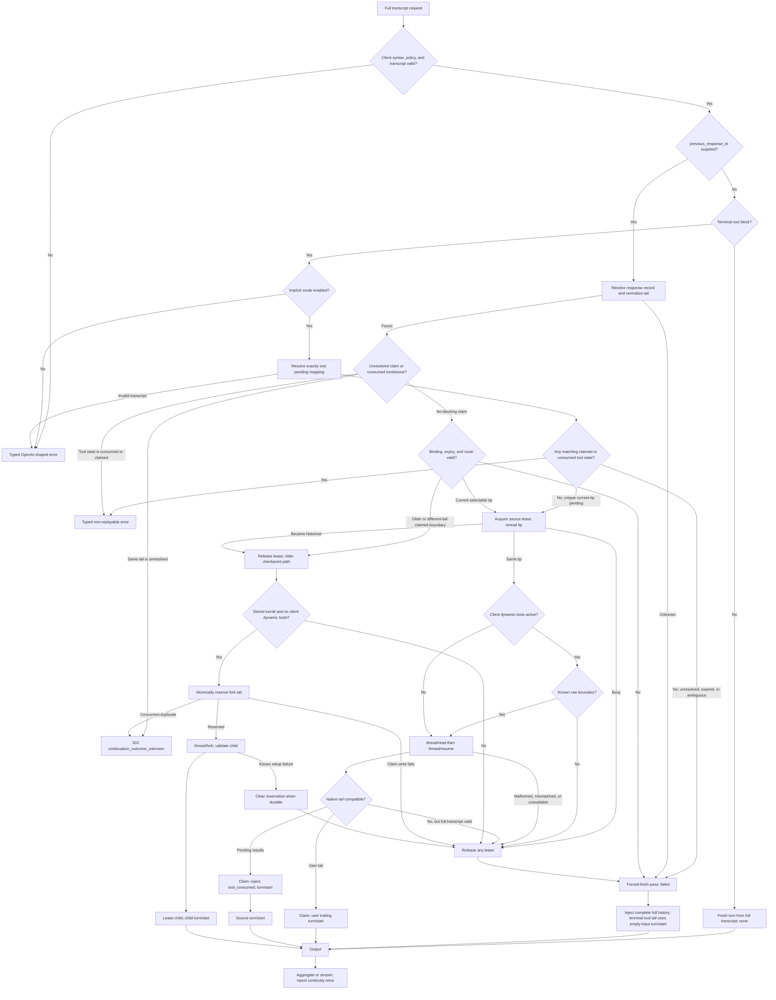
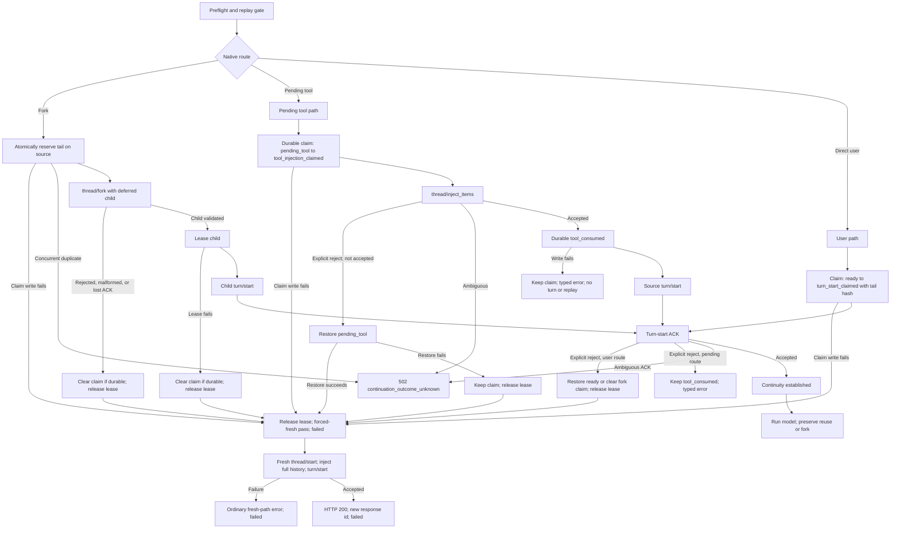
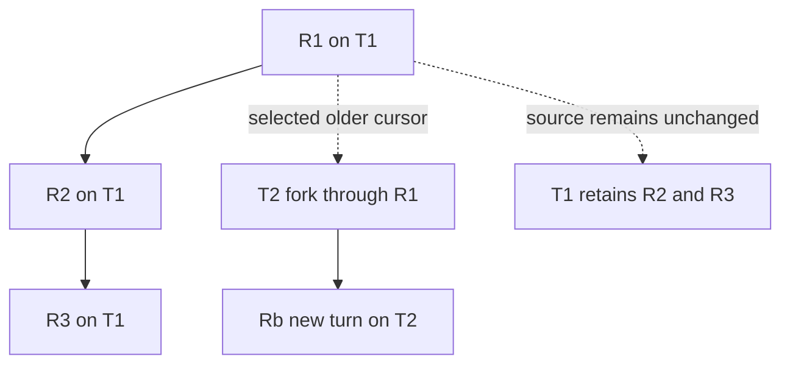

# Stage 09: Thread continuity and safe branching

## Status

Planned and not implemented. This stage supersedes the current `x_codex.threadReused` boolean,
the "newest response only" restriction, and the Stage 05 rule that a request with
`previous_response_id` never triggers `thread/start` when implementation begins. It is a design
and acceptance gate; it does not change runtime source, tests, schemas, or user-facing
documentation yet.

## Summary

Thread continuity lets a client submit its complete intended Chat Completions transcript while
the proxy uses retained Codex history when it can do so safely. The selector is the existing
nonstandard proxy extension `previous_response_id`: it is either absent, points at the current
response tip, or points at a retained older response. The proxy reports the outcome through the
nonstandard response-level `x_codex.threadContinuity` extension enum:

| Value | Meaning |
| --- | --- |
| `none` | No selector was supplied; a fresh thread ran. |
| `reuse` | The selected current tip continued the same Codex thread. |
| `fork` | The selected retained older response created a native Codex child thread. |
| `failed` | Continuity was selected or inferred but was not established. A successful HTTP 200 with this value is the result of the one-shot fresh redirect; an error with this value means no fresh result completed. |

`x_codex.threadReused` is removed; there is no alias. The extension is nonstandard and appears
once on an aggregate response, or only on the first SSE chunk. Every successful response has an
`id`, including a redirected fresh response.

Once routing is classified, every pre-header JSON error carries the actual top-level
`x_codex.threadContinuity` outcome. `reuse` and `fork` are reported only after their turn start
is accepted. A continuity attempt that redirects or ends in a typed setup/uncertainty error is
`failed`; client-validation errors raised before routing omit the field. Preserve nested
`error.x_codex.reset_at` metadata. SSE emits continuity only on its first chunk; a later error
event never repeats it. A setup failure before the first chunk follows the JSON rule.

## Public contract

### Routing rules

1. The selector is the nonstandard proxy extension `previous_response_id`. Without it and
   without a terminal tool block, start a fresh thread and report
   `x_codex.threadContinuity: "none"`.
2. Without `previous_response_id`, a valid terminal tool block uses implicit continuation when
   that mode is enabled. Resolve exactly one unexpired pending mapping; a unique current-tip
   mapping follows same-thread reuse. If any matching call ID belongs to
   `tool_injection_claimed` or `tool_consumed`, return the typed non-replayable error with
   `"failed"`; this replay gate precedes fallback. Only an otherwise unresolved, expired, or
   ambiguous lookup redirects once to a forced-fresh pass over the complete transcript and
   reports `"failed"`.
3. With implicit mode disabled, that terminal-tool shape remains the pre-routing client error
   requiring `previous_response_id`; it carries no continuity metadata. Malformed, orphaned,
   mismatched, or otherwise unrepresentable tool input likewise remains a typed pre-routing
   client error and does not redirect.
4. A selector for the selected thread's current response tip uses native same-thread resume and
   reports `"reuse"` only after resume and the next turn start both succeed.
5. A valid retained older response uses native `thread/fork` at its stored turn boundary and
   reports `"fork"` only after the child is validated, its tail is claimed, and its turn starts.
6. There is no force-fork request field. A client chooses a cursor with the agreed continuation
   selector; the proxy decides whether that cursor is a tip or branch point.
7. The downstream client always sends its full intended transcript. Successful reuse and fork
   ignore the replayed prefix and consume only trailing new input or the pending tool results.
   Native history is internal: old reasoning, command deltas, and internal tool events are never
   replayed downstream.
8. Built-in Codex tools remain observational. Client-defined dynamic tools retain the Stage 05
   tool-call/result contract and are subject to the boundary capability rule below.

### Redirect fallback and errors

When selected or inferred continuity fails in a safely known state before the side-effect
boundary, the proxy redirects the request once through the fresh path. This includes an unknown,
evicted, or expired cursor; binding mismatch; a busy tip; a missing or non-resumable thread;
malformed or mismatched setup responses; invalid fork-child fields; known setup rejection;
claim-write failure before the dependent side effect; and an unavailable dynamic-tool boundary.
The redirect removes the internal selector and sets a non-public `forceFresh`/`redirected` guard
that bypasses both explicit and implicit continuity. That guard is required for a terminal tool
block: merely deleting `previous_response_id` would repeat implicit lookup and could loop.

The forced-fresh pass receives the complete validated transcript. A user-ending transcript uses
the ordinary history-plus-user-input path. A tool-ending transcript injects every complete
assistant call/output pair, including its terminal block, then invokes the ordinary empty-input
`turn/start`. A successful redirect returns HTTP 200 with a new reusable response ID, adopts the
request's effective policy, and reports `x_codex.threadContinuity: "failed"`. If a source or
child lease was acquired, release it before entering the fresh path.

Concrete example: two clients select current response R1 while its Codex thread is already
running. The second request does not wait, append behind the active turn, or fork the busy tip.
It clears R1 from the internal request, marks the derived pass as forced fresh, replays the full
validated transcript into a new thread, and returns that new response with `"failed"`. If the
same failure happens while the transcript ends in a complete assistant-call/tool-output block,
the fresh pass injects that block as history and uses an empty-input turn instead of rejecting
the request solely because its last message has role `tool`.

The redirect has three deliberate limits:

- Client syntax, policy, and transcript-representability failures are still typed client errors;
  fallback does not reinterpret malformed or unsafe input.
- The redirect guard permits exactly one fresh attempt. A failure in that pass returns the
  ordinary fresh-path error with top-level `"failed"`; it never redirects again.
- After `turn/start` or `thread/inject_items` may have been accepted, an ambiguous outcome
  returns HTTP 502 `continuation_outcome_unknown` with top-level `"failed"` and is never
  redirected or retried.

An explicit native `turn/start` rejection known not to have been accepted is safe: for direct
reuse, atomically restore `ready` and clear the tail claim; for a fork, remove that tail's fork
claim; then release the lease and redirect. If either cleanup write fails, leave the durable
claim conservative, release the lease, and still make the one safe fresh attempt because the
native rejection is known. An explicit injection rejection known not to have been accepted
similarly attempts to restore `pending_tool`, releases the lease, and redirects; if restoration
fails, leave the durable claim conservative and still make the one safe fresh attempt. After
confirmed pending-tool injection, the checkpoint remains `tool_consumed`; a subsequent start
failure does not replay that already accepted injection through fallback.

A later model failure after reuse or fork has already succeeded does not rewrite `reuse` or
`fork` to `failed`; the continuity result describes thread setup, not model completion. Existing
nested error metadata, such as `reset_at`, remains unchanged. A failure inside the redirected
fresh path surfaces as the ordinary fresh-path error with top-level `"failed"`; there is no
second redirect. A source thread remains unchanged after a fork, and its retention timestamp is
changed only by the mandatory pre-fork claim: reserving a tail extends the shared retention
deadline, and that monotonic extension is not rolled back when the claim resolves. Later child
activity does not refresh the source again.

### Dynamic-tool boundary

Native fork cannot enable a reliable raw-response boundary, so it is allowed only when the
request has no client-defined dynamic tools; a fork-shaped request with active dynamic tools is
redirected fresh with `failed`. A tool-bearing thread resumed after restart is allowed only when
the current transport proves the boundary capability; a pinned or resumed thread without that
capability is also redirected fresh before turn start or injection with `failed`. Built-in
Codex tools do not trigger this restriction. `tool_choice: "none"` is safe when no active
dynamic tools exist.

Implicit tool IDs must be known, unexpired, and unambiguous to reuse a native pending mapping;
lookup failures redirect fresh under routing rule 2. A complete full transcript that does not
match the selected pending batch can also redirect fresh because it remains independently
representable. Orphaned results, unanswered calls, and other unrepresentable terminal tool
blocks remain typed client errors.

### Native trailing input

For native reuse or fork, the selected response ID must immediately precede exactly one of these
tails in the client's intended transcript:

- one terminal `user` message; or
- one validated contiguous terminal block of `role: "tool"` results matching the selected pending
  batch.

The `ready` checkpoint uses the user tail; a `pending_tool` checkpoint uses only its matching
terminal tool-result block. Any other pairing cannot use native continuation: redirect if the
complete transcript is independently representable, otherwise return a typed client error. All
earlier messages are the ignored replay prefix. The client declares the selected ID as the
boundary; the proxy cannot compare the submitted prefix with native history. A redirected fresh
request sends the full transcript and explicitly bypasses implicit correlation.

## Routing flow

## Side-effect boundary

Fork is not the unsafe side-effect boundary: `deferGoalContinuation: true` prevents automatic
execution, so an explicit fork rejection, malformed fork response, or lost fork acknowledgement
before child turn start clears its reserved tail when durable and redirects fresh with `failed`
(leaving a possible orphan). The unsafe boundary is the first point at which app-server may have
accepted `turn/start` or `thread/inject_items`. Before that boundary, failure may redirect. At or
after it, an ambiguous outcome is an error and must not execute the same side effect again. This
includes a child `turn/start` acknowledgement lost after a valid fork.

The pending path has an additional durable guard. Never call `thread/inject_items` unless the
`pending_tool` to `tool_injection_claimed` write committed. A claim-write failure occurs before
the dependent side effect and therefore redirects fresh. If injection is explicitly rejected as
not accepted, attempt to restore `pending_tool`; a failed restore keeps disk and memory
conservatively claimed, but the known-not-accepted result still permits the one fresh attempt.
After confirmed injection, `tool_consumed` must commit before `turn/start`; a write failure
keeps the claim, prevents start and replay, and returns the typed backend/state error. A
successful response is not terminally emitted until its response mapping is durable. If final
mapping fails, an aggregate returns a typed error; an SSE response ends with a terminal error
and its response ID is explicitly non-reusable. Downstream commits IDs only after terminal
success.

## Branch topology

In the branch example, the client trims R2, submits its edited continuation while selecting R1,
and receives a new response on T2. R2 and R3 remain on T1 and are not replayed or mutated.

Two concrete races are normative:

- Two requests concurrently select current R1. Request A acquires T1; request B observes the
  current-tip lease as busy, makes no native continuation call, and redirects once through a
  fresh thread with `failed`. B does not queue or rescue-fork R1.
- A client has R1 → R2, trims R2 from its local transcript, and submits an edited continuation
  selecting R1. The proxy forks through R1, sends only the new turn to the child, and returns
  `fork`; R2 is not present in the branch.

## Architecture and data flow

### Request phases

1. Parse the standard Chat Completions request and the agreed continuation selector. Validate
   client syntax, policy, transcript representability, and dynamic-tool shape before any
   app-server side effect.
2. Load the opaque response mapping from the authoritative store. A selector maps to a
   response, thread, source turn, and continuity binding; raw Codex identifiers never appear in
   the public API. Normalize the submitted native tail and check unresolved claims and
   non-replayable tool tombstones before binding, expiry, or tip/fork classification. The same
   tail as an unresolved direct or fork attempt returns `continuation_outcome_unknown`; it must
   never be converted into a fresh redirect merely because the record later became historical
   or the submitted binding differs. Selectorless implicit lookup applies the same precedence:
   any matching `tool_injection_claimed` or `tool_consumed` record blocks replay before an
   unresolved/expired/ambiguous result is allowed to redirect.
3. Classify the request as `none`, current-tip `reuse`, older-response `fork`, or redirect the
   request fresh with `failed`. The redirect constructs a derived internal request with no
   `previousResponseId` and a one-shot force-fresh guard; it does not re-enter implicit lookup.
   Setup responses that are malformed or inconsistent are redirect inputs before model
   execution.
4. For a current-tip candidate, acquire the source lease synchronously from the JavaScript
   request scheduler's perspective, immediately reread the mapping before any `await`, and verify
   that the same ready/pending tip still owns the lease. If unavailable, redirect fresh. If the
   reread now says historical, release the lease and route through the ordinary older-checkpoint
   fork path. Release the source lease before every redirect. This prevents appending R1 after it
   advanced to R2.
5. For a native fork, first verify a stored `turnId` and no client-defined dynamic tools, then
   atomically add the normalized tail hash to the source record before calling `thread/fork`.
   The compare-and-set rejects a same-hash winner from a concurrent request with
   `continuation_outcome_unknown`; different hashes can proceed without lost updates. Call
   `thread/fork` with `threadId`, `lastTurnId` set to the selected response's stored `turnId`
   (inclusive), `excludeTurns: true`, `deferGoalContinuation: true`, `ephemeral: false`, `model`,
   and only validated supported thread-policy fields. Deliberately omit `path`, `beforeTurnId`,
   `baseInstructions`, `developerInstructions`, and unsupported reasoning-effort overrides.
   Validate the child against the effective request and the stored binding — no pre-fork
   `thread/read` round trip: top-level model, cwd, normalized `reasoningEffort`,
   `approvalPolicy`, `approvalsReviewer`, and sandbox policy; a nonempty child ID different from
   the source; `forkedFromId` equal to the source; `ephemeral: false`; idle status;
   `canAcceptDirectInput: true`; empty turns because `excludeTurns` was requested; valid
   `instructionSources`; child `cwd` equal to the response cwd;
   `forkResponse.thread.modelProvider === forkResponse.modelProvider`; and
   `forkResponse.model === request.model`. Fork inheritance plus the validated child/source
   relationship is authoritative because the collapsed record design stores no provider and
   performs no pre-fork read. Any mismatch before child turn start is redirected fresh; no
   provider field is added to the durable checkpoint binding.
6. Start the selected turn with exactly the native trailing input described above. Do not send
   the replayed transcript prefix to a reused or forked native thread. For pending results,
   atomically transition `pending_tool` to `tool_injection_claimed` before `thread/inject_items`,
   inject each complete call/output pair once, and transition to `tool_consumed` before
   `turn/start`. An uncertain injection crosses the side-effect boundary and cannot redirect to
   a fresh replay. A redirect sends the full transcript, including representable paired
   historical and terminal tool rounds; the forced-fresh path injects them and starts an
   empty-input turn when the transcript ends in tools.
7. Aggregate or stream standard output. Suppress native history and internal tool events from
   downstream output. Persist a new response mapping only after the response is reusable.
8. Add `x_codex.threadContinuity` at the response envelope boundary. For SSE, emit it only in
   the first chunk; subsequent chunks do not repeat it.

### Fork lifecycle

The source mapping stores the turn boundary needed for a fork. Reserve the normalized tail on
that source before fork creation, then validate the child before its lease and turn start. Since
the fork defers goal continuation, explicit rejection, malformed response, mismatched child
relation, or a lost fork acknowledgement before child turn start can clear the claim and redirect
fresh with `failed`; an abandoned pre-turn child can remain as a logged orphan. If claim cleanup
cannot commit, preserve it conservatively and still redirect because no child turn was started.
Do not attempt deletion merely to tidy state. A lost or ambiguous child `turn/start`
acknowledgement is different: it is after the executable side-effect boundary and returns HTTP
502 `continuation_outcome_unknown` without retry.

`runtimeWorkspaceRoots`, `activePermissionProfile`, `serviceTier`, `historyMode`, and other
informational metadata are not equality-gated: there is no public selector or stored comparator
for them. Security comes from the exact source binding plus explicit fork parameters and
reapplication of cwd, sandbox, approval, and environment policy at `turn/start`.

### Persistence schema

The authoritative durable state file remains `continuations.json` under `--state-dir`; its
unreleased schema version bumps from 0 to 2 in place. Version 1 stays untrusted because Stage 07
reserved it for an abandoned shape. There is no second state file, import
marker, or quarantine name. The store stays single-kind: one record per response ID, with
optional claim fields. Checkpoint records use these lifecycle states:

- `ready` and `pending_tool` are the only states eligible to be the one current tip per thread;
  at most one of either exists for a thread.
- `superseded` retains an older forkable checkpoint, except that consumed-tool tombstones are
  never converted into branchable history.
- `tool_injection_claimed` and `tool_consumed` are non-replayable tombstones. A claim is made
  before injection and is never erased merely because a process crashed or disconnected.
- `turn_start_claimed` marks a current ready source whose direct reuse start is guarded by a
  claim; it is non-replayable until terminal resolution.
- Natural TTL expiry is derived from `expiresAt`; `expired` is not a persisted state. An
  unresolved claim overrides ordinary cursor expiry until the claim-retention window ends, and
  taking or preserving a claim durably sets `expiresAt` to at least `now + retentionMs`. That
  record-level deadline is shared and monotonic: a later fork claim may extend all older claims,
  and clearing a claim does not restore an earlier expiry. This deliberately favors replay safety
  over prompt reclamation without adding per-claim records or deadlines.
- `failed` is a response outcome, never a persisted state.

Records gain one field and two optional claim fields:

- `turnId?: string | null` — the durable source turn boundary. Every newly created response
  mapping requires a nonempty `turnId`; claim/state mutations of migrated records preserve an
  absent or explicit `null` boundary until a later successful response creates a new mapping.
- `claimedTailHash?: string` — while `turn_start_claimed`, the SHA-256 of the canonical exact
  native tail whose direct start is unresolved.
- `activeForkTailHashes?: string[]` — SHA-256 hashes of unresolved fork tails through this
  boundary, stored as a unique lexicographically sorted set. Multiple children may fork the
  same boundary concurrently with different tails.

The v2 schema and runtime validator enforce the replay invariants, not just the field types.
`claimedTailHash` is required exactly when state is `turn_start_claimed` and is otherwise
forbidden. `activeForkTailHashes`, when present, is nonempty, unique, sorted, and allowed only on
`superseded` or `turn_start_claimed` records. Every hash is exactly 64 lowercase hexadecimal
characters. `pendingCalls` is required and nonempty for `pending_tool`,
`tool_injection_claimed`, and `tool_consumed`, and forbidden for the other states. A recognized
version 2 file containing any invalid record or field combination fails startup without changing
the file; records are never selectively dropped because doing so could erase a replay guard.

Tail hashes use the existing `bindingHash`/`canonicalJson` encoding so retry behavior is stable
across restart. Hash the normalized native tail as
`{ version: 1, tail: normalizedTail }`: recursively sort object keys by UTF-16 code-unit order,
preserve array order and JSON primitive encoding, serialize with `canonicalJson`, and SHA-256 the
UTF-8 bytes. `normalizedTail` is exactly the validated terminal user input or the ordered
terminal tool outputs passed to the native route. The hash is deliberately independent of
whether the request was initially classified as reuse or fork, so an unresolved direct start
still blocks the same tail after its source becomes a historical fork boundary. Check existing
claims before binding/expiry fallback; the source record itself supplies identity and claim kind.

| Transition | Durable ordering and result |
| --- | --- |
| Direct reuse | Atomically change `ready` to `turn_start_claimed` and write `claimedTailHash` before `turn/start`. |
| Direct or pending claim-write failure | Make no dependent native call, release the source lease, and redirect fresh; the last durable source record remains authoritative. |
| Known direct-start rejection | Atomically restore `ready` and clear `claimedTailHash`, then apply the redirect. |
| Known fork-child start rejection | Remove that tail hash from `activeForkTailHashes`, then apply the redirect; source remains selectable. |
| Rejection cleanup-write failure | Preserve the conservative claim, release the lease, and make the one safe fresh attempt because native rejection is known; do not pretend the source became reusable. |
| Ambiguous direct start or crash | Keep the claimed checkpoint and `claimedTailHash`; return non-retryable `continuation_outcome_unknown`. |
| Ambiguous child start or crash | Keep the tail hash in `activeForkTailHashes`; return non-retryable `continuation_outcome_unknown`. |
| Accepted direct-reuse start | Keep the claim until terminal resolution; a successful final mapping atomically supersedes the source, creates the new tip, and clears the claim. |
| Accepted fork-child start | Keep the fork tail claim until terminal resolution; a successful final mapping creates the child tip and removes only that hash from the source, leaving the source otherwise unchanged. |
| Known terminal model failure | Resolve by route and clear the claim: direct ready reuse supersedes its claimed predecessor; a pending-tool route retains its non-branchable `tool_consumed` tombstone; a fork leaves its source checkpoint unchanged. A later deliberate retry or branch is allowed only through the resulting route rules. |
| Pending tool injection | Claim `pending_tool` before injection; after confirmed injection, set `tool_consumed` before the subsequent `turn/start`. |
| Native fork | Atomically append the tail hash to `activeForkTailHashes` before `thread/fork`; a same-hash concurrent loser returns uncertainty, while other tails remain selectable. |
| Fork claim-write or child-lease failure | Do not start the child, clear a written tail claim when durable, release any lease, and redirect fresh; a validated unused child may remain. |
| New response on same thread | Add the new `ready`/`pending_tool` tip and supersede an eligible ready predecessor; never erase an uncertain claim, tail hash, or turn-start claim. |

Exact-retry semantics: a selector whose record carries a matching tail hash within its
claim-retention window — either claim kind — returns non-retryable HTTP 502
`continuation_outcome_unknown`, even if ordinary cursor retention would have expired. A different tail may
fork the same source independently. This blocks a proxy/client retry from silently duplicating
an ambiguous attempt without blocking independent branches. A resolved attempt has no remaining
tail hash and does not block a later deliberate retry. While its checkpoint is
`turn_start_claimed`, a source is eligible only as an older fork boundary, never for direct
resume. Once a native start may have advanced T1, old R1 is never restored to direct-reusable
state; only a known explicit rejection restores it.

Pending-tool transitions are durable and ordered: atomically move `pending_tool` to
`tool_injection_claimed` before `thread/inject_items`; on an explicit injection rejection known
not to have been accepted, restore `pending_tool` when durable and redirect fresh; a failed
restore leaves the conservative claim in place but does not make the known-not-accepted
injection ambiguous. On successful injection, move to `tool_consumed` before `turn/start`. An
ambiguous injection or crash while claimed keeps the non-replayable claim and returns a typed
`continuation_outcome_unknown` error. Consumed-tool tombstones never become branchable
`superseded` records: a new response on that thread leaves `tool_injection_claimed` and
`tool_consumed` unchanged and adds the new ready/pending tip.

Migration is in place. On load, a version 0 file is imported immediately: valid `ready`,
`pending_tool`, and `superseded` records migrate directly; a persisted v0 `expired` value maps
conservatively to `tool_injection_claimed` (v0 used it as a pre-injection replay tombstone); a
v0 `superseded` record with `pendingCalls` maps conservatively to `tool_consumed`; absent or
explicit `null` `turnId` is preserved. The rewritten version 2 snapshot is committed before the
HTTP listener serves requests; failure to commit it fails startup. A corrupt or foreign file is
treated as an empty untrusted store and left untouched until the first write, matching current
behavior; this explicitly includes the abandoned version 1 shape, which is not imported. A file
with a version newer than supported is left untouched and fails startup to prevent downgrade
overwrite or split brain. A syntactically recognized version 2 file that fails the v2 invariants
also fails startup as described above rather than being treated as a foreign file.

Fork usage starts from the source `usageTotal` baseline. Omit usage if exact subtraction is not
possible. Fresh `none` and `failed` responses use a zero baseline.

Every mutation uses commit-then-publish: build a candidate snapshot, atomically persist it,
then replace the in-memory map. On write failure, retain the last durable in-memory view. This
snapshot is committed before any dependent side effect. A response mapping is the commit point
for reusability: no downstream response ID is committed until terminal success and durable
mapping, and a failed final mapping never exposes a new ready state. The aggregate returns a
typed error or the SSE stream a terminal error with a non-reusable ID. These mapping/state
errors retain the already classified top-level continuity outcome: `failed` for a redirected
path, or `reuse`/`fork` after continuity was established.

Caching is orthogonal to continuity. Report exact cached-token counts when app-server supplies
them; never promise positive cache reuse because a thread was reused or forked.

## Edge-case register

Each row is an implementation and test obligation. "Redirect fresh" means the internal selector
is stripped, explicit and implicit continuity are bypassed once, and the complete transcript
re-runs through the fresh path. Success is HTTP 200 with a new reusable response ID and
`"failed"`; a failure in that fresh pass is returned with `"failed"` and is not retried.

| # | Case | Required behavior |
| ---: | --- | --- |
| 1 | No selector and no terminal tool block | Fresh thread; `none`. |
| 2 | Current tip | Direct same-thread reuse; `reuse` after turn start. |
| 3 | No selector with terminal tool block | If valid and implicit mode is enabled, first reject any matching claimed/consumed tombstone with a top-level `failed`; otherwise a unique current-tip pending mapping follows reuse and an unresolved, expired, or ambiguous lookup redirects fresh with `failed`. If implicit mode is disabled, return the pre-routing error requiring `previous_response_id`. Malformed or unrepresentable input is also a typed pre-routing client error. |
| 4 | Retained older response | Native fork at its stored boundary; `fork`. |
| 5 | Branch of branch | Fork from the selected retained response's own source boundary; never include later sibling history. |
| 6 | Concurrent forks or advancing source | Lease each child only; atomically mutate only the source's claim set. The source may advance while a child forks through its stored `lastTurnId`; exclude later source turns from the child. |
| 7 | Unknown or evicted cursor, user tail | Redirect fresh; `failed`. |
| 8 | Expired cursor, user tail | Redirect fresh; `failed`. |
| 9 | Unknown, expired, or ambiguous cursor, tool tail | Redirect fresh when the full call/output transcript is complete; `failed`. Otherwise return the typed representability error. |
| 10 | Migrated record with absent/null `turnId` | Current tip/pending may reuse and preserve the missing boundary through claim mutations; a newly created response mapping must contain its returned nonempty turn ID. A historical legacy record redirects fresh with `failed`. |
| 11 | Binding mismatch before execution | Check unresolved same-tail claims first. If none blocks the request, redirect fresh with `failed`; do not bind to an unsafe native thread. |
| 12 | Selector on `pending_tool` with a user tail | Native continuation is unavailable; redirect the independently valid full transcript fresh with `failed`. |
| 13 | Current-tip busy or tip advances during lease/recheck | Busy redirects fresh with `failed`; if reread is historical, release and route through the normal older fork. Never queue, rescue-fork a busy tip, or append R1 after R2. |
| 14 | Missing or non-resumable thread | Redirect fresh; `failed`. |
| 15 | Malformed or mismatched `thread/read` response | Redirect fresh; `failed`; distinguish from malformed client input. |
| 16 | Malformed or mismatched `thread/resume` response | Redirect fresh; `failed`; do not trust the response. |
| 17 | Malformed or mismatched `thread/fork` response | Clear the reserved tail when durable, then redirect fresh; `failed`; a possible child may remain as a logged orphan. |
| 18 | Bad fork child relation or effective fields | Clear the reserved tail when durable, then redirect fresh; `failed`; do not use the child. |
| 19 | Lost fork ACK before child turn | Clear the reserved tail when durable, then redirect fresh; `failed`; an orphan may remain and be logged, with no child turn retry. |
| 20 | Dynamic boundary unavailable on resume | Redirect fresh; `failed`. |
| 21 | Fork-shaped request with client dynamic tools | Redirect fresh; `failed`; native fork never carries dynamic tools. |
| 22 | Pending tool-result mismatch | If the complete transcript is independently representable, release the lease and redirect fresh; otherwise return the typed validation error with top-level `failed`. Never reinterpret a tool result as user text. |
| 23 | Unrepresentable terminal tool block | Typed unrepresentable-client-request error before routing; no redirect. |
| 24 | Uncertain pending-tool injection | 502 `continuation_outcome_unknown` with top-level `failed`; claim stays non-replayable; no redirect or fresh replay. |
| 25 | Native `turn/start` explicit rejection, user tail | Known safe: restore `ready` or clear the fork tail claim, then redirect fresh; `failed`. |
| 26 | Native `turn/start` explicit rejection after confirmed pending injection | Keep `tool_consumed`; typed tool-tail error with top-level `failed`; never restore or replay the accepted injection. |
| 27 | Explicit injection rejection known not accepted | Restore `pending_tool` when durable, release the lease, and redirect fresh. If restoration fails, keep the claim and still make the one safe fresh attempt. |
| 28 | Ambiguous source `turn/start` ACK | 502 `continuation_outcome_unknown` with top-level `failed`; claim stays; exact-tail retry blocked. |
| 29 | Lost child `turn/start` ACK | 502 `continuation_outcome_unknown` with top-level `failed`; fork tail hash stays; no redirect and no fresh replay. |
| 30 | Post-acceptance model failure | Preserve established `reuse`/`fork` and report the model error normally. Direct ready reuse supersedes its predecessor; pending-tool continuation retains `tool_consumed`; fork leaves its source unchanged. Clear the resolved claim. |
| 31 | Client disconnect | Cancel lifecycle and lease safely; do not leak active turns or erase an uncertain claim. |
| 32 | Redirected fresh-path failure | Ordinary fresh-path typed error with top-level `failed`; no second redirect. |
| 33 | Redirected response ID reuse | Allocate a unique reusable response ID; never overwrite the selected mapping. |
| 34 | Prefix disagrees with selected boundary | Ignore the prefix for reuse/fork; use only the selected native boundary and trailing input. |
| 35 | Usage reset or unknown baseline | Use zero for fresh `none`/`failed`; omit fork usage unless exact subtraction succeeds. |
| 36 | Zero cache | Report exact zero/omitted cached tokens; never infer cache reuse. |
| 37 | Invalid request syntax or policy | Typed OpenAI-shaped error before routing and before any redirect. |
| 38 | Replay of claimed or consumed tool mapping | Typed non-replayable-continuation error with top-level `failed`; never inject again. |
| 39 | `pending_tool` claim write failure | Do not inject; release the lease and redirect fresh with `failed`. |
| 40 | `tool_consumed` write failure after confirmed injection | Keep the claim; typed backend/state error with top-level `failed`; do not turn-start or redirect. |
| 41 | Final response-mapping write failure | Aggregate gets a typed error; SSE emits a terminal error and marks its ID non-reusable; downstream commits no ID. |
| 42 | Direct reuse claim write failure | Do not call native `turn/start`; release the lease and redirect fresh with `failed`. |
| 43 | Fork tail-claim write failure | Do not call `thread/fork`; redirect fresh with `failed`. |
| 44 | Claim after crash/restart | An exact-tail retry within refreshed claim retention returns 502 `continuation_outcome_unknown` with top-level `failed`, even if direct reuse would now classify as fork; a different tail may fork; a consumed pending mapping returns the typed non-replayable error. |
| 45 | Consumed tool tombstone with a new response | Leave `tool_injection_claimed`/`tool_consumed` unchanged; add the new tip without making the tombstone branchable. |
| 46 | Commit-then-publish failure | Keep the last durable disk and memory snapshot; failed writes expose no new ready state. |
| 47 | Corrupt or foreign state file | Empty, untrusted store; file untouched until the first write; existing behavior. |
| 48 | Future schema version | Startup failure with a clear error; no downgrade overwrite. |
| 49 | v0-to-v2 in-place import mappings | Persisted `expired` maps to `tool_injection_claimed`; `superseded` with `pendingCalls` maps to `tool_consumed`; others migrate directly; claim mutations preserve absent/null `turnId`, while newly created response mappings require a nonempty value. |
| 50 | Redirect after a lease was acquired | Release the source or child lease before fresh thread setup, including busy, validation, claim-write, and known-rejection routes. |
| 51 | Tool-tail redirect recursion | The internal forced-fresh guard bypasses implicit lookup, injects the complete call/output history, starts one empty-input turn, and cannot redirect again. |
| 52 | Fork child lease failure after claim | Durably remove that fork tail claim, release any lease, and redirect fresh. If cleanup fails, preserve the claim conservatively and still make the one safe fresh attempt. |
| 53 | Claim taken near ordinary expiry | Extend shared `expiresAt` to at least one full configured retention period from claim time. Later claims may extend older claims; cleanup never rolls the deadline back. |
| 54 | Known rejection but claim cleanup cannot commit | Keep the source conservatively claimed, release its lease, and redirect fresh; do not expose the source as reusable. |
| 55 | Concurrent fork-claim add/remove operations | Serialize or compare-and-swap source-record mutations so one child cannot erase another child's unresolved hash; a same-tail loser returns 502 with top-level `failed` without forking or redirecting, and the unique sorted set persists atomically. |
| 56 | Resume/fork emits retained historical events | Correlate output to the newly accepted turn ID and suppress all replayed history, reasoning, command deltas, and internal tool events from downstream output. |
| 57 | Recognized v2 file violates a claim/state invariant | Fail startup without changing the file; never drop only the invalid record or erase its replay guard. |

## Test and acceptance criteria

### Deterministic fake-server coverage

Add offline fake app-server cases for every edge-case register row, including:

- aggregate metadata placement and first-chunk-only SSE metadata;
- success and error envelopes, including `continuation_outcome_unknown` and preserved nested
  `reset_at`;
- in-place schema migration: the three conservative v0 state mappings, absent/null `turnId`
  preservation through legacy claim mutations, the v1 reservation and v2 rewrite, nonempty
  `turnId` validation for newly created mappings, the complete v2 claim/state invariant matrix,
  corrupt/foreign import handling, and recognized-invalid/future-version startup failure;
- current-tip reuse, native fork arguments and child validation without a pre-fork
  `thread/read`, branch-of-branch and concurrent-fork isolation, atomic lease/recheck races,
  busy redirect behavior, and lease release on every redirect path;
- claim lifecycle: direct-claim restore on known rejection, fork tail claims, exact-retry 502,
  different-tail branching, crash/restart recovery, resolved-claim clearing after success or
  terminal model failure, route-specific direct/fork cleanup, retention refresh, and consumed
  tombstones; include concurrent fork-claim mutations without lost hashes;
- redirect behavior: every safely known continuity failure with an independently representable
  user or tool tail, including busy and pre-side-effect claim-write failures, makes exactly one
  forced-fresh attempt; success yields HTTP 200 with `failed` and a new reusable ID, while a
  redirected fresh-path failure surfaces the ordinary error with no recursion;
- dynamic tools on fresh/reuse/fork/restart paths, boundary capability absence, implicit ID
  expiry/ambiguity, implicit-disabled pre-routing errors, pending mismatch, terminal tool-block
  validation, fresh terminal-tool history injection plus empty-input start, state transitions,
  and replay guards, including selectorless claimed/consumed lookup, claim-write, restoration,
  and consumed-write failures; explicitly cover pending injection followed by an accepted start
  and model failure, and pending injection followed by an explicit start rejection;
- exact usage baselines, fork subtraction, usage reset, and cached-token reporting; and
- disconnect, process failure, explicit rejection, lost ACK, post-acceptance model failure, and
  final response-mapping failure for aggregate and SSE, including commit-then-publish
  memory/disk consistency; and
- resume/fork notification filtering that proves retained historical reasoning, command output,
  and internal tool events are never emitted as deltas for the new HTTP response.

The fake server must assert that a reused or forked request does not receive the replayed
prefix, that a redirected fresh request receives the complete transcript, that terminal-tool
redirects bypass implicit lookup and make one empty-input turn, and that uncertain side effects
are never retried.

### Opt-in live verification

Use one serial live scenario with only `gpt-5.6-luna`, a loopback proxy, and a temporary
`workspace-write` root. Allow at most three `rawResponse/completed` model calls for this
scenario, within the suite-wide ceiling of 32:

1. Fresh R1.
2. Current-tip R2 reuse.
3. Fork from R1 after the client trims R2; inspect the actual child/source thread and turn IDs
   through app-server inspection or captured mappings, and prove the child includes the R1
   boundary while excluding R2.

Observe cache metadata but do not require a positive cached-token count. The live scenario is
opt-in, never part of the default test command, and its expected maximum is exactly three model
calls.

### Stage gate

Stage 09 is complete only when the design above is reflected in the runtime contract and
schemas, every register row has deterministic success/failure coverage, metadata is stable for
aggregate and SSE responses, side-effect uncertainty cannot duplicate commands, and the bounded
three-call live scenario passes. A provider limitation leaves Stage 09 incomplete unless this
plan is separately reviewed and revised.

## Documentation and compatibility work

Implementation must update, in one reviewed change:

- the root README and API `CONTRACT` with the continuity enum, the redirect rule, and the full
  transcript requirement;
- `plans/05-tools-and-threads.md` to replace the boolean, the item 13 never-`thread/start` rule,
  the implicit-disabled terminal-tool rejection, and the item 14 superseded-reference decision;
- `protocol/schemas/response-mapping.schema.json` and its version fixtures for the in-place
  version 2 bump, `turnId`, and claim fields while retaining version 1 as untrusted;
- the changelog with the removal of `x_codex.threadReused` and the additive continuity behavior;
- quality/CI documentation with deterministic register coverage and the opt-in three-call live
  test; and
- any generated protocol or fixture documentation required by the implementation review.

The compatibility consequence is deliberate: clients that read the prerelease boolean must move
to `x_codex.threadContinuity`; a selector on an older response that previously received the
superseded-reference error can now receive a native fork; continuity failures on user tails that
previously received typed errors can now receive HTTP 200 `failed` from a redirected fresh
thread; valid tool-tail continuity failures and current-tip contention can likewise receive a
fresh HTTP 200 `failed`. Malformed input and ambiguous side effects retain typed errors. No
standard Chat Completions field is redefined: `previous_response_id` is a nonstandard proxy
request extension, and `x_codex.threadContinuity` is a nonstandard response extension.

## Assumptions and non-goals

### Assumptions

- The pinned app-server implements native `thread/fork` with the documented inclusive boundary
  and returns a child identity that can be validated.
- A successful response can be mapped to a durable nonempty `turnId`; legacy records are the only
  records that may lack one.
- The proxy can distinguish explicit rejection from an accepted-but-unacknowledged side effect.
- The JavaScript request scheduler can perform lease acquisition and the immediate mapping reread
  without an intervening `await`, and listener startup waits for the in-place schema rewrite.
- Full transcript conversion remains subject to existing representability and policy checks.

### Non-goals

- No force-fork request extension, raw thread-ID exposure, or downstream replay of native history.
- No attempt to delete uncertain or abandoned children.
- No second state file, import marker, or quarantine mechanism.
- No approximation of token usage or cache reuse.
- No relaxation of policy, malformed-input validation, dynamic-tool correlation, or typed errors.
- No implementation, schema migration, runtime behavior, or live test in this documentation stage.
